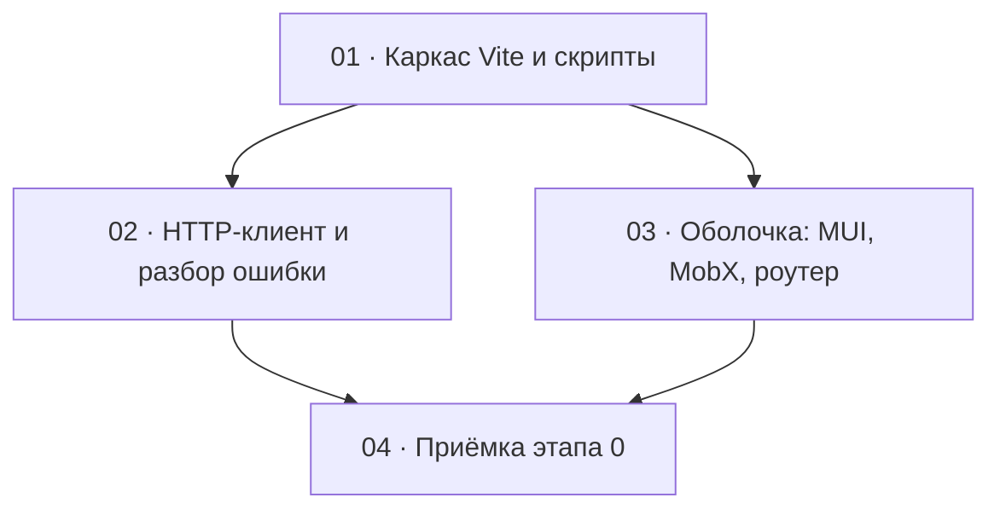

# Этап 0 — Каркас: декомпозиция на задачи

Статус этапа: выполнен. Сводка — [status.md](../status.md).

Источник: [03-technical-specification.md, раздел «Этап 0»](../../03-technical-specification.md#этап-0--каркас),
плюс из раздела 2 то, что каркас обязан принести в первый день: один
HTTP-клиент и один разбор тела ошибки.

Формат файлов — по [task-writing-guidelines.md](../task-writing-guidelines.md).
Порядок номеров — топологический порядок графа ниже.

## Граф зависимостей

## Список задач

| # | Задача | Зависит от | Файл | Статус |
|---|--------|------------|------|--------|
| 1 | Каркас Vite, скрипты, порт 5173, `VITE_API_BASE_URL` | — | [01-project-scaffold.md](./01-project-scaffold.md) | выполнена |
| 2 | HTTP-клиент и разбор тела ошибки | 1 | [02-http-client.md](./02-http-client.md) | выполнена |
| 3 | Оболочка: тема MUI `ruRU`, MobX, маршрут-заглушка | 1 | [03-app-shell.md](./03-app-shell.md) | выполнена |
| 4 | Приёмка этапа 0 целиком | 2, 3 | [04-step0-acceptance.md](./04-step0-acceptance.md) | выполнена |

## Почему такой порядок

- **01** — единственный корень. Пока нет `package.json`, порта и типа
  `VITE_API_BASE_URL`, ни клиент, ни оболочку не собрать и не проверить.
  Задача намеренно узкая: в ней нет MUI и нет разбора ошибок.
- **02 и 03** зависят только от 01 и не зависят друг от друга. Их можно
  вести параллельно: клиент живёт в `src/api/`, оболочка — в `src/app/`,
  `src/stores/` и `src/main.tsx`. Общий файл, который обе будут править,
  — `package.json`, и его трогает только 03 (у 02 новых зависимостей нет,
  транспорт — `fetch`).
- **04** ничего не добавляет к продукту. DoD этапа — это оболочка на
  `http://localhost:5173` и зелёные `lint` / `test` / `build` вместе, плюс
  тест разбора ошибки. Пока 02 и 03 не сошлись в одном дереве, этот пункт
  нечему закрывать.

## Решения по открытым вопросам этапа

ТЗ фиксирует стек и DoD, но не раскладку каталогов и не границу «клиент
есть, логина ещё нет». Ниже — решения, чтобы реализация не выбирала их
заново. Открытых вопросов, которые блокируют старт этапа, нет.

- **Каталоги.** `src/api/` — HTTP и разбор ошибки. `src/app/` — вход,
  тема, роутер, оболочка. `src/stores/` — сторы MobX, по домену. На этапе 0
  в `src/stores/` только пустой корневой стор; `session` появится на
  [этапе 1](../step-1/README.md).
  Второй параллельный способ хранить то же самое через россыпь `useState`
  не заводится.
- **Транспорт — `fetch`, без axios и без генерации из OpenAPI.** Так уже
  решено в ТЗ,
  [пункт 4 раздела 5](../../03-technical-specification.md#5-открытые-вопросы--принятые-по-умолчанию-решения).
- **Порт только 5173, `strictPort: true`.** Origin уже записан в
  `CORS_ORIGIN_ADMIN` бэкенда. Молчаливый переход на 5174 выглядит как
  «API не отвечает».
- **Оболочка на этапе 0 в API не ходит.** Клиент покрыт тестами и не
  импортируется экраном, пока нет логина. Первый вызов —
  `POST /auth/staff/login` на этапе 1.
- **Поведение `401` (refresh, один общий refresh на пачку, выход из
  сессии) на этап 0 не переносится.** В ТЗ оно стоит в
  [этапе 1](../../03-technical-specification.md#этап-1--сессия-сотрудника).
  На этапе 0 клиент только умеет поставить access-токен, если вызывающий
  код его уже дал, и разобрать тело ошибки.
- **Инструменты — те же семейства, что у `quizbeat-srv`.** oxlint
  (`--type-aware`), Prettier (`singleQuote`, `trailingComma: all`), Vitest.
  Мажор Vitest — тот же, что уже стоит на бэкенде (на момент этой
  декомпозиции — 4). Конкретные версии фиксирует `package.json` задачи 1
  по установленным типам, не этот файл.
- **Локаль MUI — `ruRU` с первого экрана**, даже если на заглушке почти
  нет строк самой библиотеки. Подключать локаль вместе с первым
  настоящим экраном значит пропустить её.
- **Playwright и прочий e2e на этапе 0 не появляются.** ТЗ оставляет их
  на потом, если ручного прохода перестанет хватать.
