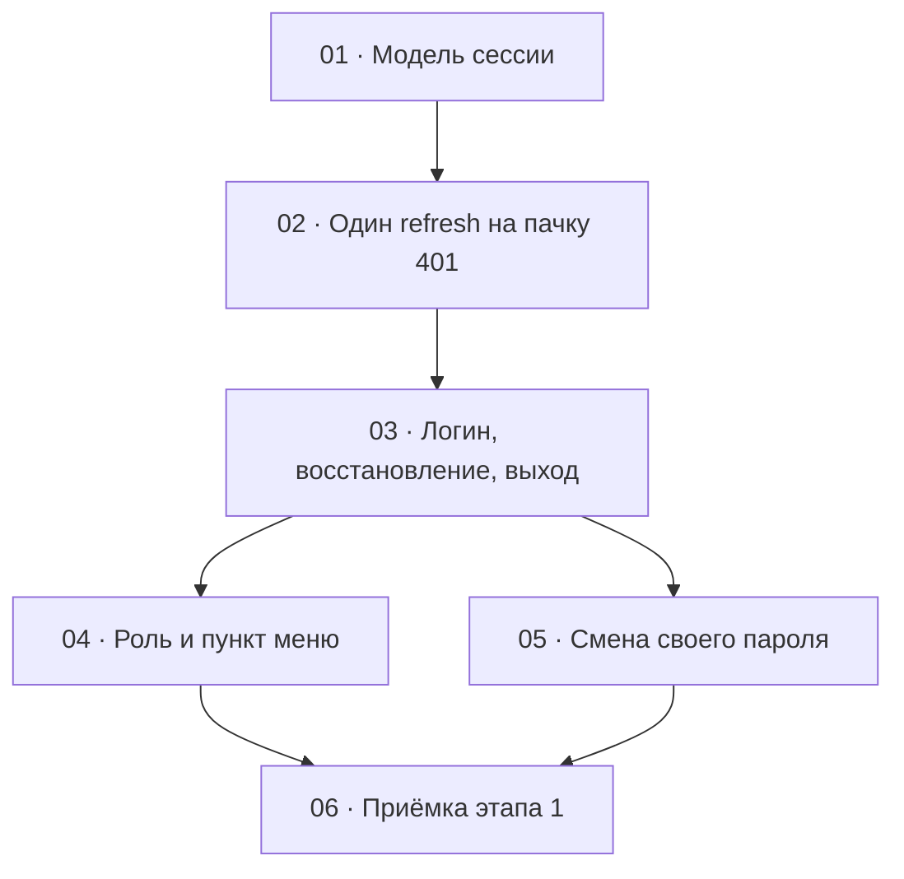

# Этап 1 — Сессия сотрудника: декомпозиция на задачи

Статус этапа: выполнен. Сводка — [status.md](../status.md).

Источник: [03-technical-specification.md, раздел «Этап 1»](../../03-technical-specification.md#этап-1--сессия-сотрудника)
и поведение `401` из [раздела 2](../../03-technical-specification.md#2-общие-технические-требования).
Карта вызовов — [сессия](../../02-staff-api.md#2-сессия) и строка
`PATCH /admins/me/password` в [сотрудниках](../../02-staff-api.md#3-сотрудники).

Формат файлов — по [task-writing-guidelines.md](../task-writing-guidelines.md).
Порядок номеров — топологический порядок графа ниже. Этап опирается на
уже принятый каркас: [HTTP-клиент](../step-0/02-http-client.md),
[оболочка и корневой стор](../step-0/03-app-shell.md).

## Граф зависимостей

## Список задач

| # | Задача | Зависит от | Файл | Статус |
|---|--------|------------|------|--------|
| 1 | Модель сессии: разбор access, память, `localStorage` | этап 0, задачи [2](../step-0/02-http-client.md) и [3](../step-0/03-app-shell.md) | [01-session-model.md](./01-session-model.md) | выполнена |
| 2 | Вызовы login/refresh/logout и один refresh на пачку `401` | 1 | [02-refresh-on-401.md](./02-refresh-on-401.md) | выполнена |
| 3 | Экран логина, восстановление при загрузке, выход | 2 | [03-login-logout.md](./03-login-logout.md) | выполнена |
| 4 | Роль в оболочке и пункт меню сотрудников | 3 | [04-role-menu.md](./04-role-menu.md) | выполнена |
| 5 | Смена своего пароля | 3 | [05-change-own-password.md](./05-change-own-password.md) | выполнена |
| 6 | Приёмка этапа 1 целиком | 4, 5 | [06-step1-acceptance.md](./06-step1-acceptance.md) | выполнена |

## Почему такой порядок

- **01** — данные сессии без сети. Пока нет разбора access и договора,
  где лежат refresh и email, [задача 2](./02-refresh-on-401.md) не знает,
  что подставлять в повторный запрос и что стирать при отказе.
- **02** — единственное место, где живёт ротация. Экран логина её не
  реализует: иначе форма и перехватчик `401` правят один и тот же клиент.
  Тест DoD про пачку параллельных `401` закрывается здесь, моком `fetch`,
  до браузера.
- **03** зависит от 02 и первая меняет маршруты оболочки. Логин,
  восстановление при старте и выход вызывают уже готовые методы стора и
  не шлют свой `fetch`.
- **04 и 05** зависят только от 03 и друг от друга не зависят: пункт меню
  не нужен, чтобы сменить свой пароль, а форма пароля не смотрит на роль.
  Их можно вести параллельно. Общие файлы — оболочка и таблица маршрутов,
  которые заводит 03. Если правки столкнутся, сначала вливается 04
  (пункт в навигации), затем 05 (ссылка в шапке и маршрут пароля).
- **06** ничего не добавляет к продукту. DoD этапа — живой
  `quizbeat-srv` и зелёные проверки вместе. Пока 04 и 05 не в одном
  дереве, приёмке нечего закрывать.

Этап попадает под обязательное человеческое ревью: сессия (где лежит
refresh, как ротируется пара, что происходит при `401`) и развилка
`ADMIN` / `SUPER_ADMIN`. Это [правила разработки, раздел 7](../../04-development-rules.md#7-ревью--двухуровневое),
не отдельная задача.

## Решения по открытым вопросам этапа

ТЗ задаёт поведение сессии и не фиксирует ни стык с тестом оболочки
этапа 0, ни то, что `401` на смене пароля бывает двух разных смыслов.
Ниже — решения, чтобы задачи не выбирали их порознь. Вопросов, которые
блокируют старт, нет.

- **Один single-flight на всё приложение.** Восстановление при загрузке
  и пачка `401` делят один и тот же promise refresh. Вкладки между собой
  не синхронизируются: вторая вкладка, предъявившая уже ротированный
  refresh, получит `401` и окажется на логине. `BroadcastChannel` и
  слушатель `storage` на этом этапе не появляются.
- **Сессию стирает отказ refresh, а не любой сбой.** `401` на
  `POST /auth/staff/refresh` и повторный `401` исходного запроса после
  успешной ротации очищают access и refresh. `429` и сетевой обрыв
  refresh не стирают: гард лимита отрабатывает до хендлера, токен не
  ротируется, а обрыв вообще не ответ сервера. Повтора `429` нет.
  Исходные запросы в этом случае завершаются ошибкой и остаются на
  совести экрана.
- **Не каждый `401` — протухший access.** Неверный текущий пароль на
  `PATCH /admins/me/password` — `401` с `message`
  `Current password is incorrect`, access валиден. Такой ответ не
  запускает refresh и не выводит из сессии. Протухший access на том же
  пути по-прежнему идёт через один refresh. Разборщик передаёт вызов,
  перехватчик из задачи 2 второй раз не переписывается.
- **Успешная смена пароля забывает refresh и оставляет access.** Сервер
  отзывает refresh и новую пару не выдаёт. Звать refresh сразу после
  `204` — гарантированный `401` и вылет на логин при ещё живом access.
  Текущая вкладка работает до TTL access. Перезагрузка ведёт на логин,
  потому что refresh в хранилище уже нет.
- **Пункт «Сотрудники» ведёт на заглушку `/admins`.** Запроса к API нет:
  список — [этап 2](../../03-technical-specification.md#этап-2--сотрудники).
  Пункт виден только при `role === 'SUPER_ADMIN'`. Прямой заход `ADMIN`
  на эту заглушку в этапе 1 показывает тот же текст, без самодельного
  `403`: отказа сервера ещё не к чему привязать, его рисует этап 2.
- **Логин, refresh и logout не проходят через перехватчик `401`.**
  Неверный пароль на форме — это `401`, и при сохранённом старом refresh
  перехватчик иначе «починит» чужую сессию или затрёт сообщение сервера.
- **Шапка «Админка QuizBeat» общая для логина и для сессии.** Тест
  этапа 0, который ждёт на `/` отсутствия полей email и пароля,
  переписывается в [задаче 3](./03-login-logout.md): без сессии эти поля
  как раз есть. Утверждение про заголовок сохраняется.
- **Подпись JWT клиент не проверяет и библиотеку для неё не ставит.**
  Читается средний сегмент access. `type !== 'staff'` — это не сессия
  сотрудника. Email из токена не читается: его там нет, он пишется в
  хранилище в момент логина.
