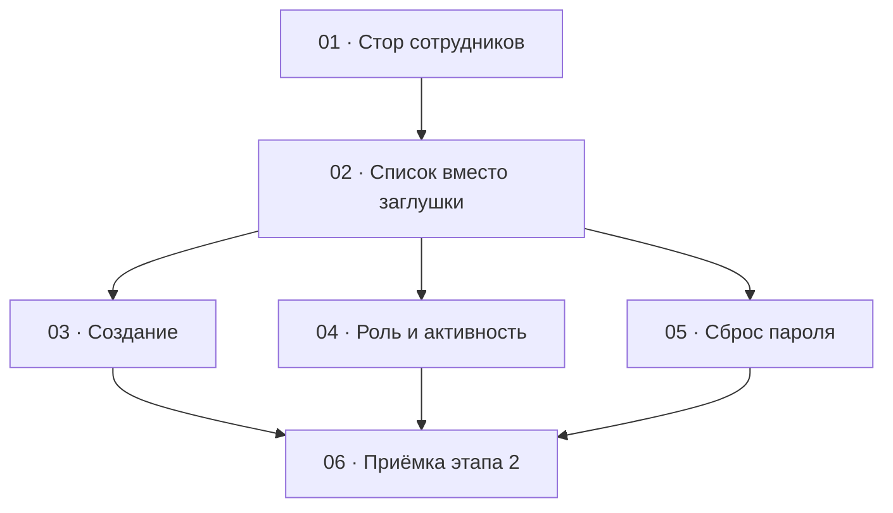

# Этап 2 — Сотрудники: декомпозиция на задачи

Источник: [03-technical-specification.md, раздел «Этап 2»](../../03-technical-specification.md#этап-2--сотрудники).
Карта вызовов — [сотрудники](../../02-staff-api.md#3-сотрудники).
Смена своего пароля уже закрыта
[задачей 5 этапа 1](../step-1/05-change-own-password.md) и здесь не
повторяется.

Формат файлов — по [task-writing-guidelines.md](../task-writing-guidelines.md).
Порядок номеров — топологический порядок графа ниже. Этап опирается на
сессию: [HTTP-клиент](../step-0/02-http-client.md),
[стор сессии](../step-1/01-session-model.md),
[перехватчик `401`](../step-1/02-refresh-on-401.md),
[пункт меню и заглушка `/admins`](../step-1/04-role-menu.md).

## Граф зависимостей

## Список задач

| # | Задача | Зависит от | Файл |
|---|--------|------------|------|
| 1 | Стор сотрудников: список, создание, правка, деактивация, сброс пароля | этап 1 (клиент с access и разбор ошибки) | [01-admins-store.md](./01-admins-store.md) |
| 2 | Список вместо заглушки: поиск, фильтры, пагинация, отказ `403` | 1 | [02-admins-list.md](./02-admins-list.md) |
| 3 | Создание сотрудника | 2 | [03-create-admin.md](./03-create-admin.md) |
| 4 | Смена роли, деактивация и повторная активация | 2 | [04-role-and-activity.md](./04-role-and-activity.md) |
| 5 | Сброс пароля другого сотрудника | 2 | [05-reset-password.md](./05-reset-password.md) |
| 6 | Приёмка этапа 2 целиком | 3, 4, 5 | [06-step2-acceptance.md](./06-step2-acceptance.md) |

## Почему такой порядок

- **01** — единственное место, где собирается query и различаются
  `DELETE` (тело `200`) и `PATCH .../password` (пустой `204`). Пока
  методы не зафиксированы тестом, экран списка превратит
  `isActive=false` в отсутствие параметра, и деактивированные пропадут
  из списка по умолчанию. Экран в эту задачу не входит.
- **02** заменяет заглушку `/admins` из
  [задачи 4 этапа 1](../step-1/04-role-menu.md). Поиск, фильтры и
  пагинация есть на первом экране списка, отдельной следующей задачей
  их не добавляют. Пункт меню и правило видимости уже есть: эта задача
  их заново не заводит. Тест этапа 1, который ждёт на `/admins`
  отсутствия `fetch`, переписывается здесь: маршрут начинает ходить в
  API.
- **03, 04 и 05** зависят только от списка и друг от друга не зависят.
  Созданию кнопки строки не нужны, смена роли не шлёт `newPassword`,
  сброс пароля не меняет `role`. Их можно вести параллельно. Общий
  файл — экран списка, который заводит 02. Если правки столкнутся,
  сначала вливается 03 (кнопка и диалог создания), затем 04 (роль,
  деактивация, активация на строке), затем 05 (ещё одно действие
  строки — сброс пароля).
- **06** ничего не добавляет к продукту. DoD этапа — две живые учётки
  на `quizbeat-srv` и зелёные проверки вместе. Пока 03, 04 и 05 не в
  одном дереве, приёмке нечего закрывать.

Этап попадает под обязательное человеческое ревью: развилка
`ADMIN` / `SUPER_ADMIN` и действия, которые отзывают чужой или свой
refresh. Это [правила разработки, раздел 7](../../04-development-rules.md#7-ревью--двухуровневое),
не отдельная задача.

## Решения по открытым вопросам этапа

ТЗ задаёт набор вызовов и DoD и не фиксирует, чем деактивация отличается
от `PATCH`, что делать с сессией, когда цель — текущий сотрудник, и
какой текст ждать от `403`. Ниже — решения, чтобы задачи не выбирали их
порознь. Вопросов, которые блокируют старт, нет.

- **Деактивация — `DELETE /admins/:id`, повторная активация —
  `PATCH` с `isActive: true`.** Кнопка «деактивировать» не шлёт
  `PATCH` с `isActive: false`. `AdminsService.remove` отзывает
  refresh, а `update` токены не трогает. Отдельного
  эндпоинта активации нет.
- **Фильтр активности — три состояния, по умолчанию «все».** Пока
  человек не выбрал «только активные» или «только неактивные»,
  параметра `isActive` в query нет. Сервер тогда отдаёт и активных, и
  деактивированных, статус виден в строке. Значение фильтра уходит
  строкой `true` или `false`. Пустая строка — не состояние «все»: сервер
  не примет её как boolean и ответит `400`.
- **Прямой заход на `/admins` всегда шлёт `GET /admins`.** И у
  `SUPER_ADMIN`, и у `ADMIN`. Отказ — это `403` с `message` сервера,
  без таблицы. Если выйти по роли ещё до запроса, DoD закроется
  самодельным экраном. [Задача 4 этапа 1](../step-1/04-role-menu.md)
  такой экран специально не рисовала. `403` сессию не стирает и refresh
  не запускает.
- **Роль в оболочке читается из access, не из строки списка.**
  `PATCH /admins/:id` refresh не отзывает и payload токена не меняет.
  После того как сотрудник понизит собственную роль, пункт «Сотрудники»
  остаётся, пока жив текущий access. Ответ списка в стор сессии не
  пишется.
- **Если действие над своим id отзывает refresh, клиент забывает только
  refresh.** Это `DELETE` своей строки и `PATCH /admins/:id/password`
  на свой id. Метод — тот же, что после смены своего пароля в
  [задаче 5 этапа 1](../step-1/05-change-own-password.md): access
  остаётся, logout не вызывается, новый refresh не запрашивается.
  Чужой id сессию не меняет. Смена роли не забывает ни свой, ни чужой
  refresh.
- **Клиент не вычисляет по текущей странице, последний ли это
  супер-админ.** Список может быть отфильтрован, страница — неполная.
  Кнопки деактивации и понижения доступны. Отказ сервера `409` с
  `Cannot deactivate or demote the last active SUPER_ADMIN`
  показывается как `message`. Строка на экране до ответа сервера не
  меняется.
- **После изменения список перечитывается с теми же фильтрами и той же
  страницей.** Строку из ответа в таблицу в обход этого запроса не
  вставляют: фильтр может её скрыть, и это ожидаемо. Роль и статус до
  ответа сервера не меняются. При `409` и `400` на экране остаётся то,
  что прислал последний успешный список.
- **В форме создания роль по умолчанию — `ADMIN`.** Сервер сам значение
  `role` не подставляет, поле обязательное. Типичная вторая учётка этого
  этапа — админ, под которым проверяют экраны. В теле запроса роль всё
  равно есть; до отправки её можно сменить на `SUPER_ADMIN`.
- **Сообщения сервера показываются как пришли.** `409`
  (`Admin with this email already exists`, текст про последнего
  супер-админа) и `403` приходят по-английски, как и
  `Invalid credentials` на логине. Оболочка их не переводит. Подписи
  кнопок, фильтров и пустого списка — русские.
- **Отдельного маршрута `/admins/:id` нет.** Создание, роль, активность
  и сброс пароля — действия на списке. Id в URL клиента попадает только
  в путь сброса `.../:id/password`, его собирает стор.
