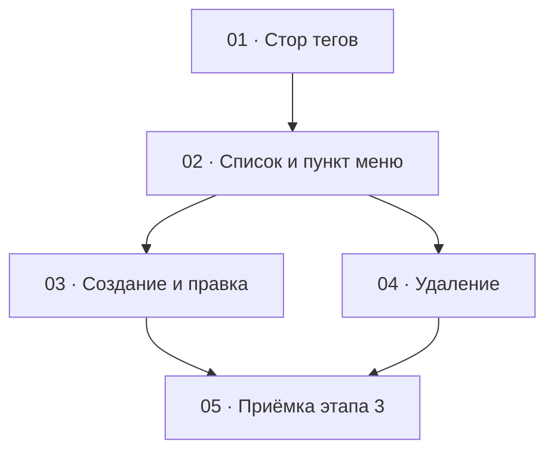

# Этап 3 — Справочник тегов: декомпозиция на задачи

Источник: [03-technical-specification.md, раздел «Этап 3»](../../03-technical-specification.md#этап-3--справочник-тегов).
Карта вызовов — [теги](../../02-staff-api.md#4-теги).

Формат файлов — по [task-writing-guidelines.md](../task-writing-guidelines.md).
Порядок номеров — топологический порядок графа ниже. Этап опирается на
сессию: [HTTP-клиент](../step-0/02-http-client.md),
[стор сессии](../step-1/01-session-model.md),
[перехватчик `401`](../step-1/02-refresh-on-401.md),
[навигация оболочки](../step-1/04-role-menu.md). Пункт «Сотрудники» и его
тест к этому моменту уже переписаны
[списком этапа 2](../step-2/02-admins-list.md): этап 3 добавляет «Теги»
рядом и это утверждение про `/admins` не откатывает.

## Граф зависимостей

## Список задач

| # | Задача | Зависит от | Файл |
|---|--------|------------|------|
| 1 | Стор тегов: список, создание, правка, удаление | этап 1 (клиент с access и разбор ошибки) | [01-tags-store.md](./01-tags-store.md) |
| 2 | Список и пункт меню: поиск, пагинация, оба названия | 1 | [02-tags-list.md](./02-tags-list.md) |
| 3 | Создание и правка: код и оба перевода | 2 | [03-tag-form.md](./03-tag-form.md) |
| 4 | Удаление тега с подтверждением | 2 | [04-delete-tag.md](./04-delete-tag.md) |
| 5 | Приёмка этапа 3 целиком | 3, 4 | [05-step3-acceptance.md](./05-step3-acceptance.md) |

## Почему такой порядок

- **01** — единственное место, где собирается query и различаются
  `DELETE` (`204` без тела) и `POST`/`PATCH` (тело тега). Пока форма
  запроса не зафиксирована тестом, экран легко отправит перевод полем
  `text` (так у заметок) или одним объектом вместо массива из двух
  локалей. Экран в эту задачу не входит.
- **02** заводит маршрут `/tags` и пункт меню. Заглушки с прошлого этапа
  нет: «Сотрудники» появились раньше, потому что без второй учётки нельзя
  проверить роль. Теги доступны и `ADMIN`, и `SUPER_ADMIN`, отдельного
  `403` по роли на `/tags` сервер не отвечает. Поиск и пагинация есть на
  первом экране списка. Кнопки создания, правки и удаления сюда не
  входят: иначе тест «строка показывает оба названия» смешается с
  диалогами.
- **03 и 04** зависят только от списка и друг от друга не зависят.
  Создание и правка — одна форма: те же три поля и то же правило «без
  одного перевода запрос не уходит». Дробить их на две задачи значит
  дважды собрать это правило и дважды править один диалог. Удаление —
  другое действие: подтверждение, пустой `204`, в ответе тега нет.
  Общий файл — экран списка, который заводит 02. Если правки столкнутся,
  сначала вливается 03 (кнопка «Создать» и правка строки), затем 04
  (ещё одно действие строки — удаление).
- **05** ничего не добавляет к продукту. DoD этапа — живой
  `quizbeat-srv` и зелёные проверки вместе: тег с обоими названиями
  находится поиском, название меняется, тег удаляется, запрос без
  одного перевода не уходит. Пока 03 и 04 не в одном дереве, приёмке
  нечего закрывать.

Этап не попадает под обязательное человеческое ревью
[раздела 7](../../04-development-rules.md#7-ревью--двухуровневое):
сессии и токенов он не касается, развилки ролей нет, загрузки файлов нет.
Пункт «Теги» виден любой роли staff — это не развилка `ADMIN` /
`SUPER_ADMIN`. Уровень 1 (`/code-review` с явным уровнем) остаётся
правилом на каждую задачу и отдельной задачей этапа не становится.

## Решения по открытым вопросам этапа

ТЗ задаёт набор вызовов и DoD и не фиксирует, где живёт правка при
отсутствии `GET /tags/:id`, что именно уходит в `PATCH`, и кому виден
пункт меню. Ниже — решения, чтобы задачи не выбирали их порознь.
Вопросов, которые блокируют старт, нет.

- **Пункт «Теги» виден при любой роли staff.** И `ADMIN`, и
  `SUPER_ADMIN`. Сервер на `/tags` стоит под `StaffAuthGuard` без
  `RolesGuard`. Прямой заход с сессией шлёт `GET /tags`. Отдельного
  экрана `403` по роли, как на `/admins`, здесь нет: серверу нечего
  отвергать по роли. Без сессии путь по-прежнему ведёт на логин.
- **Маршрута `/tags/:id` нет.** `GET` одного тега на сервере нет, правка
  идёт из строки списка. Создание, правка и удаление — действия на
  списке. Id в URL клиента попадает только в путь `PATCH` и `DELETE`,
  его собирает стор.
- **Поиск — по названию перевода, не по коду.** Сервер ищет подстроку
  `name` в обеих локалях (`ILIKE`). Код в это условие не входит: запрос
  с кодом в строке поиска может законно вернуть пустую страницу. Пустой
  поиск и строка из одних пробелов параметр `search` не отправляют.
  Смена строки поиска сбрасывает страницу на `1`.
- **В строке видны код и оба названия.** Название берётся по полю
  `locale`, а не по индексу в массиве: сервер порядок элементов
  `translations` не фиксирует. Совпадение поиска по одной локали не
  прячет вторую: в ответе по-прежнему оба перевода.
- **Создание и правка — одна форма.** Поля: код, название `ru`, название
  `en`. Создание шлёт `POST` с `code` и `translations` из двух элементов.
  Правка шлёт `PATCH` с тем же составом: `code` и полный набор обеих
  локалей. Поле перевода — `name`. Опустить `translations` при правке
  нельзя: на экране человек видит оба названия, и сохранённым должно
  оказаться то, что в полях, а не прежний набор на сервере.
- **Пустой код или пустое название запрос не отправляют.** Две локали в
  форме фиксированы (`ru` и `en`), дубль одной локали форма собрать не
  может. Клиент код и названия не нормализует: сервер сохраняет строку
  как пришла, регистр кода значим (`Rock` и `rock` — разные значения
  уникального столбца).
- **Удаление жёсткое, с подтверждением.** Текст по-русски говорит:
  тег удаляется безвозвратно; композиции теряют с ним связь и сами не
  удаляются; восстановления нет. Отмена не вызывает `fetch`. Успех —
  `204` без тела. Кнопка «деактивировать» здесь неуместна: у тега нет
  `isActive`.
- **После создания, правки и удаления список перечитывается с тем же
  поиском и той же страницей.** Ответ мутации в таблицу в обход этого
  запроса не вставляется. Если поиск был по старому названию, строка
  после правки может пропасть из текущей страницы: так и должен работать
  поиск. При `409` диалог остаётся открыт, список заново не запрашивается.
  При `404` (тег уже удалён) сообщение показывается и список
  перечитывается: строки на экране больше нет.
- **Сообщения сервера показываются как пришли.** `409`
  (`Tag with this code already exists`) и `400`
  (`Translations must include exactly one entry per locale (ru, en), without duplicates`)
  приходят по-английски. Оболочка их не переводит. Подписи кнопок,
  поиска и пустого списка — русские. Код и названия рисуются текстом
  React.
- **Открытый вопрос: поведение `limit` за пределами 1…100 не
  проверено.** Карта фиксирует «по умолчанию 20, максимум 100»
  ([общие правила](../../02-staff-api.md#1-общие-правила)), но не
  описывает, что сервер делает при выходе за этот диапазон (обрезает до
  максимума или отвечает `400`) — это первый этап с явной пагинацией,
  и здесь же уместно решить дефолт. Пока значение `limit` на экране
  списка не настраивается человеком (задача 2 использует фиксированную
  величину), вопрос не блокирует старт. Поднять перед тем, как на любом
  списке (теги, сотрудники, композиции) появится выбор размера страницы
  — сверить фактическое поведение с
  [`ListTagsQueryDto`](../../../../quizbeat-srv/src/tags/dto/list-tags-query.dto.ts)
  и аналогичными DTO и дополнить карту.
