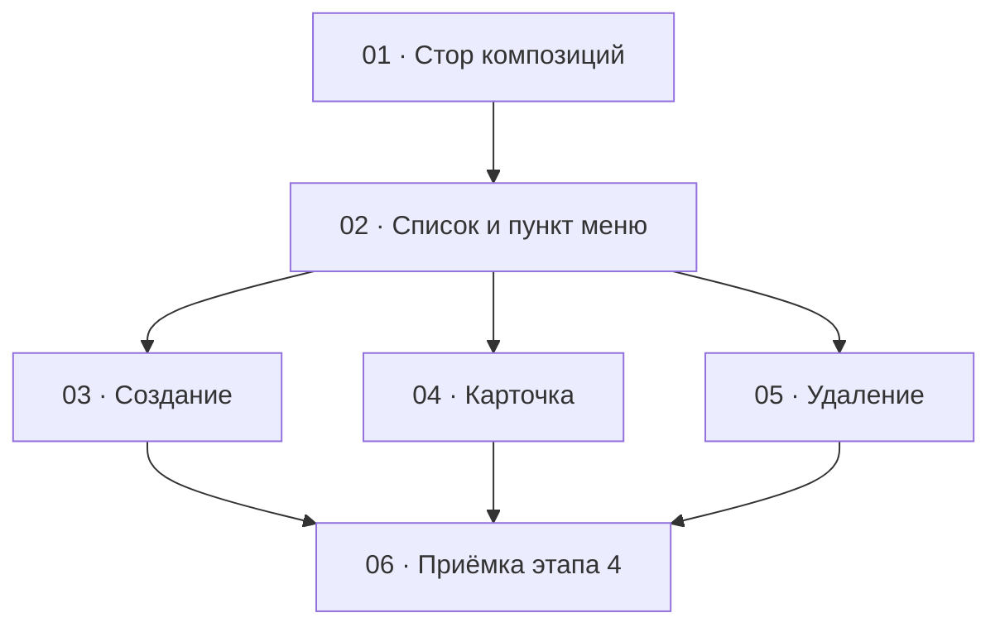

# Этап 4 — Композиции: декомпозиция на задачи

Статус этапа: не выполнен. Сводка — [status.md](../status.md).

Источник: [03-technical-specification.md, раздел «Этап 4»](../../03-technical-specification.md#этап-4--композиции).
Карта вызовов — [композиции](../../02-staff-api.md#5-композиции).

Формат файлов — по [task-writing-guidelines.md](../task-writing-guidelines.md).
Порядок номеров — топологический порядок графа ниже. Этап опирается на
сессию: [HTTP-клиент](../step-0/02-http-client.md),
[стор сессии](../step-1/01-session-model.md),
[перехватчик `401`](../step-1/02-refresh-on-401.md),
[навигация оболочки](../step-1/04-role-menu.md). Пункт «Сотрудники» и
его тест к этому моменту уже переписаны
[списком этапа 2](../step-2/02-admins-list.md); пункт «Теги» добавлен
[этапом 3](../step-3/02-tags-list.md). Этап 4 добавляет «Композиции»
рядом и видимость «Теги» и «Сотрудники» не откатывает. Стор тегов —
[задача 1 этапа 3](../step-3/01-tags-store.md): фильтр и выбор тегов
композиции вызывают его, а не второй `GET /tags`.

Аудио, отрезки, картинки и заметки в этот этап не входят — экраны для них
появятся на [этапе 5](../../03-technical-specification.md#этап-5--аудио-и-отрезки),
[этапе 6](../../03-technical-specification.md#этап-6--изображения-композиции),
[этапе 7](../../03-technical-specification.md#этап-7--заметки-а-знали-ли-вы).
`GET /compositions/:id/full` в этот этап **входит**: карточка открывается
им с самого начала, не временным стыком, который заменяется на
[этапе 8](../../03-technical-specification.md#этап-8--сборка-карточки-композиции)
— этот этап только сводит правило обновления блоков после мутаций, когда
все блоки уже есть.

## Граф зависимостей

## Список задач

| # | Задача | Зависит от | Файл | Статус |
|---|--------|------------|------|--------|
| 1 | Стор композиций: список, создание, правка, удаление | этап 1 (клиент с access и разбор ошибки) | [01-compositions-store.md](./01-compositions-store.md) | не выполнена |
| 2 | Список и пункт меню: поиск, фильтры, пагинация | 1; стор тегов этапа 3 (фильтр) | [02-compositions-list.md](./02-compositions-list.md) | не выполнена |
| 3 | Создание композиции | 2 | [03-create-composition.md](./03-create-composition.md) | не выполнена |
| 4 | Карточка: правка названия, автора, статуса и тегов | 2 | [04-composition-card.md](./04-composition-card.md) | не выполнена |
| 5 | Мягкое удаление с подтверждением | 2 | [05-delete-composition.md](./05-delete-composition.md) | не выполнена |
| 6 | Приёмка этапа 4 целиком | 3, 4, 5 | [06-step4-acceptance.md](./06-step4-acceptance.md) | не выполнена |

## Почему такой порядок

- **01** — единственное место, где собирается query (`tagIds` одной
  строкой через запятую) и тела (`tagIds` массивом uuid, снятие набора —
  `[]`, не отсутствие поля; `DELETE` с телом `200`, не пустой `204`).
  Пока форма не зафиксирована тестом, экран легко отправит повторяющийся
  query-параметр или опустит `tagIds` при очистке. Экран в эту задачу не
  входит.
- **02** заводит маршрут `/compositions` и пункт меню. Заглушки с
  прошлого этапа нет. Обе роли staff ведут композиции, отдельного `403`
  по роли сервер не отвечает. Поиск, фильтр статуса, фильтр тегов и
  пагинация есть на первом экране. Кнопки создания, правки и удаления
  сюда не входят: иначе тест сборки фильтров смешается с диалогами и
  карточкой.
- **03, 04 и 05** зависят только от списка и друг от друга не зависят.
  Создание — диалог на списке; правка — отдельный маршрут карточки;
  удаление — подтверждение и мягкий `DELETE` с телом. Смешивать их в
  одном тесте нельзя: сборка `tagIds` при создании, форма карточки и
  текст подтверждения удаления — разные проверки. Общий файл — экран
  списка из 02. Если правки столкнутся, сначала вливается 03 (кнопка
  «Создать»), затем 04 (действие строки «Изменить» и маршрут карточки),
  затем 05 (ещё одно действие строки — удаление).
- **06** ничего не добавляет к продукту. DoD этапа — живой
  `quizbeat-srv` и зелёные проверки вместе: черновик создаётся,
  находится фильтрами, публикуется сменой статуса, после удаления не
  виден, снятие последнего тега шлёт `tagIds: []`. Пока 03, 04 и 05 не
  в одном дереве, приёмке нечего закрывать.

Этап не попадает под обязательное человеческое ревью
[раздела 7](../../04-development-rules.md#7-ревью--двухуровневое):
сессии и токенов он не касается, развилки ролей нет, загрузки файлов
нет. Пункт «Композиции» виден любой роли staff — это не развилка
`ADMIN` / `SUPER_ADMIN`. Текст с сервера (названия, авторы, `message`)
рисуется как текст React, без `dangerouslySetInnerHTML`. Уровень 1
(`/code-review` с явным уровнем) остаётся правилом на каждую задачу и
отдельной задачей этапа не становится.

## Решения по открытым вопросам этапа

ТЗ задаёт набор вызовов и DoD и не фиксирует маршрут карточки, где живёт
создание и как собирается фильтр тегов. Ниже — решения, чтобы задачи не
выбирали их порознь. Вопросов, которые блокируют старт, нет. Отдельного
`GET /compositions/:id` на сервере нет — не выдумывать.

- **Пункт «Композиции» виден при любой роли staff.** И `ADMIN`, и
  `SUPER_ADMIN`. Сервер на `/compositions` стоит под `StaffAuthGuard`
  без `RolesGuard`. Прямой заход с сессией шлёт `GET /compositions`.
  Отдельного экрана `403` по роли, как на `/admins`, здесь нет. Без
  сессии путь по-прежнему ведёт на логин. Рядом остаются «Теги» (обе
  роли) и «Сотрудники» (только `SUPER_ADMIN`) — этап их видимость не
  откатывает.
- **Список — `/compositions`, карточка — `/compositions/:id`.** Это
  экран, на который [этапы 5–7](../../03-technical-specification.md#этап-5--аудио-и-отрезки)
  добавят блоки. Второго экрана редактирования не заводить.
- **Первая загрузка карточки — `GET /compositions/:id/full`, и только
  им.** Отдельного `GET /compositions/:id` на сервере нет
  ([`CompositionsController`](../../../../quizbeat-srv/src/compositions/compositions.controller.ts)
  отдаёт список, мутации и `full`), поэтому список не годится как
  источник данных карточки ни временно, ни постоянно — сервер уже отдаёт
  агрегат одним запросом, и клиент использует его с этого же этапа, а не
  подражает ему повторным `GET /compositions` по query. Прямой заход,
  переход со списка и перезагрузка — один и тот же вызов. Переход со
  строки списка **может** передать её в `location.state` как мгновенный
  заголовок (название, автор), пока идёт запрос, но не как источник
  `tags` / `clips` / `images` / `notes` / `originalAudioUrl` /
  `originalAudioDurationSec` — этих полей в ответе списка нет, только в
  `full`. `404` на `GET .../full` (нет id, мягко удалена) — состояние «не
  найдена» со ссылкой на список, не бесконечный скелет. Поля будущих
  блоков (`clips`, `images`, `notes`, аудио) в ответе уже есть на этом
  этапе (пустые массивы / `null`, пока для них нет экрана) —
  [задача 4](./04-composition-card.md) их получает и сохраняет в
  состоянии карточки, но не отрисовывает: экраны блоков читают эти же
  данные, когда появятся на этапах 5–7, вместо того чтобы делать свой
  первый запрос списка. Второго, временного способа загрузки клиент не
  заводит и этап 8 здесь ничего не заменяет — он только сводит правило
  обновления блоков **после мутаций**, когда все блоки уже есть.
- **Создание — диалог на списке, не отдельный маршрут.** Поля:
  название, автор, необязательный статус, необязательный набор тегов.
  Статус по умолчанию в форме не выбирают как «обязательно
  опубликовать»: если человек оставил «черновик» / не трогал статус,
  в `POST` поле `status` не уходит — дефолт `DRAFT` ставит
  [`CompositionsService.create`](../../../../quizbeat-srv/src/compositions/compositions.service.ts),
  не DTO. Пустой набор тегов при создании поле `tagIds` не отправляет
  (или шлёт `[]` — сервер оба варианта сводит к пустому набору). После
  `201` диалог закрыт, список перечитывается с текущими фильтрами.
- **Фильтр статуса — три состояния, по умолчанию «все».** Пока человек
  не выбрал `DRAFT` или `PUBLISHED`, параметра `status` в query нет.
  Подписи на экране — русские («Черновик», «Опубликована»); в query и
  теле уходят значения enum `DRAFT` / `PUBLISHED`.
- **Фильтр тегов — мультивыбор из стора тегов этапа 3.** В query списка
  выбранные id уходят одной строкой через запятую, семантика OR.
  Пустой выбор параметр `tagIds` не порождает. Отдельного
  непагинированного списка тегов на сервере нет: выбор читает
  `GET /tags` через стор тегов с `page` / `limit` (лимит максимум 100).
  Второго HTTP-модуля тегов не заводить.
- **В строке списка видны название, автор, статус и теги ответа.** Теги
  в ответе — полные объекты
  [`TagResponseDto`](../../../../quizbeat-srv/src/tags/dto/tag-response.dto.ts)
  (`id`, `code`, `translations`, `createdAt`), не голые uuid. Название
  тега в чипе берётся по `locale` (предпочтительно `ru`), не по индексу
  массива. Мягко удалённые в `items` не попадают: сервер фильтрует
  `deletedAt IS NULL`.
- **Поиск — подстрока названия или автора.** Сервер ищет `ILIKE` по
  `title` и `author`. Пустой поиск и строка из одних пробелов параметр
  `search` не отправляют. Смена поиска, статуса или набора тегов
  сбрасывает страницу на `1`.
- **Карточка шлёт `PATCH` с полями, которые человек меняет, и с
  `tagIds`, когда трогал набор тегов.** Снять последний тег — отправить
  `tagIds: []`, а не опустить поле: иначе набор на сервере не
  изменится. Пустой `tagIds` разрешён
  ([`assertTagsExistAndDedupe`](../../../../quizbeat-srv/src/compositions/compositions.service.ts)).
  Неизвестный uuid тега — `400` и `message`
  `One or more tagIds do not reference an existing tag`, не `409`.
- **Удаление мягкое, с подтверждением, только со списка.** Текст
  по-русски: композиция исчезнет из списка; вернуть из интерфейса
  нельзя; отдельного восстановления на сервере нет. Успех — `200` с
  заполненным `deletedAt`, не `204`. Отмена не вызывает `fetch`. Кнопка
  «деактивировать» здесь неуместна: это не сотрудник. На карточке
  удаления на этом этапе нет — DoD закрывается строкой списка.
- **После создания, правки и удаления список перечитывается с теми же
  фильтрами и той же страницей.** Ответ мутации в таблицу в обход этого
  запроса не вставляется. При `400` / `404` на форме или карточке
  сообщение показывается; при `404` на удалении список всё равно
  перечитывается (строки уже может не быть).
- **Сообщения сервера показываются как пришли.** `404` без своей строки
  уходит дефолтным Nest `Not Found`; `400` про неизвестный тег —
  английской фразой выше. Оболочка их не переводит. Подписи кнопок,
  фильтров и пустого списка — русские. Название, автор и названия тегов
  рисуются текстом React.
