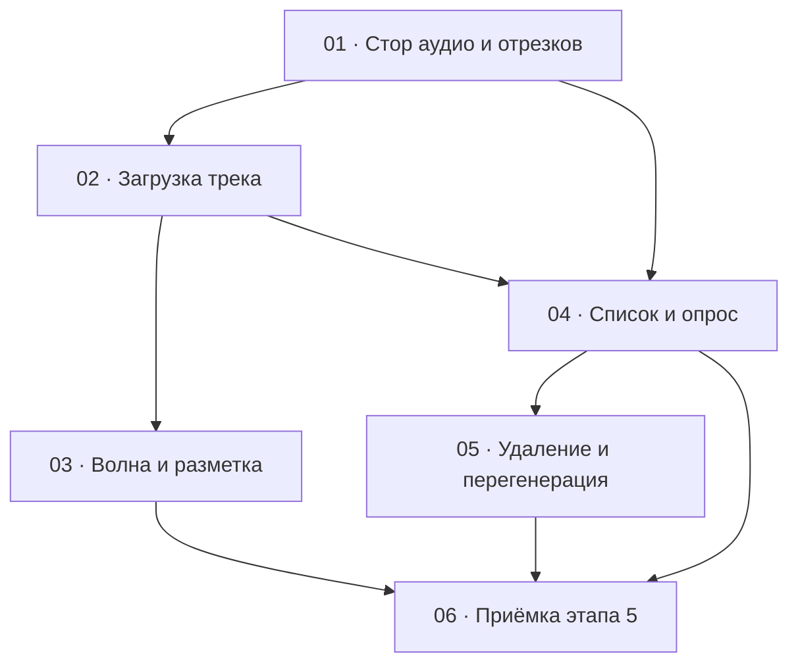

# Этап 5 — Аудио и отрезки: декомпозиция на задачи

Статус этапа: не выполнен. Сводка — [status.md](../status.md).

Источник: [03-technical-specification.md, раздел «Этап 5»](../../03-technical-specification.md#этап-5--аудио-и-отрезки).
Карта вызовов — [аудио и отрезки](../../02-staff-api.md#6-аудио-и-отрезки).

Формат файлов — по [task-writing-guidelines.md](../task-writing-guidelines.md).
Порядок номеров — топологический порядок графа ниже. Этап опирается на
карточку композиции: [стор](../step-4/01-compositions-store.md),
[список](../step-4/02-compositions-list.md),
[карточка `/compositions/:id`](../step-4/04-composition-card.md),
[HTTP-клиент](../step-0/02-http-client.md) (JSON и пустой успех; multipart
добавляет этот этап), [сессию](../step-1/01-session-model.md) и
[перехватчик `401`](../step-1/02-refresh-on-401.md).

Картинки и заметки в этот этап не входят —
[этап 6](../../03-technical-specification.md#этап-6--изображения-композиции),
[этап 7](../../03-technical-specification.md#этап-7--заметки-а-знали-ли-вы).
Карточка уже открывается одним `GET /compositions/:id/full` — решение
[этапа 4](../step-4/README.md#решения-по-открытым-вопросам-этапа); этот
этап его не перерешает и сам `GET /full` не вызывает. Ответ `full`
(в том числе `clips`, `originalAudioUrl`, `originalAudioDurationSec`) уже
есть в состоянии карточки к моменту, когда монтируются блоки этого
этапа, — они читают эти данные оттуда на первом рендере, а не делают
свой первый запрос; собственные `GET .../audio` и `GET .../clips`
остаются, но для другого: обновления протухшей ссылки, опроса статусов и
перечитывания после мутаций.

## Граф зависимостей

## Список задач

| # | Задача | Зависит от | Файл | Статус |
|---|--------|------------|------|--------|
| 1 | Стор: загрузка, URL, точки, список, удаление, перегенерация; multipart на клиенте | этап 0 (низкоуровневый вызов), этап 4 (стор композиций / корневой стор) | [01-audio-clips-store.md](./01-audio-clips-store.md) | не выполнена |
| 2 | Блок загрузки исходного трека на карточке | 1; карточка этапа 4 | [02-audio-upload.md](./02-audio-upload.md) | не выполнена |
| 3 | Волновая форма и разметка точек, отправка `points` | 2 | [03-waveform-and-points.md](./03-waveform-and-points.md) | не выполнена |
| 4 | Список отрезков, опрос, прослушивание `DONE`, явный `FAILED` | 1, 2 | [04-clips-list-and-poll.md](./04-clips-list-and-poll.md) | не выполнена |
| 5 | Удаление и перегенерация отрезка | 4 | [05-clip-delete-and-regenerate.md](./05-clip-delete-and-regenerate.md) | не выполнена |
| 6 | Приёмка этапа 5 целиком | 3, 4, 5 | [06-step5-acceptance.md](./06-step5-acceptance.md) | не выполнена |

## Почему такой порядок

- **01** — единственное место, где собираются multipart (`file`, не
  `files`), тело `{ points }`, разбор `201` загрузки
  (`originalAudioDurationSec`), `200` ссылки (`url`), пустой `204`
  удаления и ответ без `fileUrl` до `DONE`. Пока форма не зафиксирована
  тестом, экран легко поставит `Content-Type: application/json` на
  `FormData` или выдумает `fileUrl: null`. Экран в эту задачу не входит.
  Расширение HTTP-клиента под multipart — здесь же, одним методом того
  же клиента; второго `fetch` не заводить.
- **02** сажает на карточку `/compositions/:id` блок загрузки. Без него
  нет серверной длительности для разметки и нет смысла рисовать волну.
  Список отрезков и волна сюда не входят: иначе тест поля `file`
  смешается с опросом и библиотекой волны.
- **03 и 04** зависят от загрузки (и от стора), друг от друга — нет.
  Волна и точки нуждаются в длительности с последнего `201` и в URL из
  `GET .../audio`. Список и опрос читают `GET .../clips` и сами решают,
  когда остановиться. Смешивать их в одном тесте нельзя: сборка
  `points` и остановка опроса — разные проверки DoD. Общий файл —
  карточка из этапа 4 и блок из 02. Если правки столкнутся, сначала
  вливается 03 (волна и разметка рядом с загрузкой), затем 04 (список
  ниже), затем 05 (действия строки списка).
- **05** опирается на список: удаление и перегенерация — действия над
  уже показанными отрезками. Тест опроса из 04 они не переписывают.
- **06** ничего не добавляет к продукту. DoD этапа — живой
  `quizbeat-srv`, реальный файл и зелёные проверки вместе: точки
  уходят, статусы доходят до `DONE` или `FAILED`, отрезок слышен,
  удаление и перегенерация работают. Пока 03, 04 и 05 не в одном
  дереве, приёмке нечего закрывать.

Этап попадает под обязательное человеческое ревью
[раздела 7](../../04-development-rules.md#7-ревью--двухуровневое):
загрузка файлов — какое поле multipart (`file`), что клиент обещает
пользователю про тип и размер (сервер всё равно проверяет содержимое).
Развилки ролей нет: обе роли staff ведут аудио. Сессию и токены этап
не трогает. Текст с сервера (`message`, статусы) рисуется как текст
React, без `dangerouslySetInnerHTML`. Уровень 1 (`/code-review` с
явным уровнем) остаётся правилом на каждую задачу и отдельной задачей
этапа не становится.

## Решения по открытым вопросам этапа

ТЗ задаёт набор вызовов и DoD и не фиксирует интервал опроса, где на
карточке живёт блок и какую библиотеку волны ставить. Ниже — решения,
чтобы задачи не выбирали их порознь. Вопросов, которые блокируют старт,
нет. Этот этап сам `GET /compositions/:id/full` не вызывает — карточка
уже вызвала его на этапе 4, и блоки читают результат оттуда.

- **Блок живёт на карточке `/compositions/:id`.** Второго экрана и
  смены маршрута нет. Этап 4 зафиксировал карточку как единственный
  экран правки и уже открывает её одним `GET /full`; этот этап
  добавляет на неё аудио и отрезки.
- **Длительность и ссылка на оригинал при первом открытии карточки —
  из ответа `GET /full`, который уже получила и сохранила
  [задача 4 этапа 4](../step-4/04-composition-card.md).** `null` у
  `originalAudioUrl` / `originalAudioDurationSec` — состояние «трек не
  загружен» (блок загрузки доступен), не ошибка и не повод чистить
  сессию; отдельный `GET .../audio` в этом случае не нужен. Ограничения
  «после F5 длительности нет» здесь больше нет: `full` отдаёт актуальную
  длительность при каждом открытии карточки, включая перезагрузку. Сразу
  после успешного `POST .../audio` длительность обновляется из тела
  `201` (сервер не отдаёт её иначе сразу после загрузки — это серверное
  целое, не `HTMLAudioElement.duration`); URL нового файла в ответе `201`
  нет, за ним — отдельный `GET .../audio`. Отрезки при первом открытии —
  из `clips` того же ответа `full`, не отдельный `GET .../clips`.
- **Ссылка на волну при первом открытии — `originalAudioUrl` из
  `full`.** В стор/состояние как постоянный адрес её не класть: TTL
  presigned по умолчанию 3600 с
  ([общие правила карты](../../02-staff-api.md#1-общие-правила)).
  Протухшую ссылку (или после `POST .../audio`) обновляют отдельным
  `GET .../audio`, поле `url`; длительности в этом ответе нет. Прямой
  `404` на этом `GET` (когда он всё же вызван для обновления, а не как
  способ узнать о наличии трека) — состояние «трек не загружен», не
  ошибка сессии и не повод чистить refresh.
- **Поле multipart — `file` (одно).** Не `files` (это картинки этапа 6).
  Путать имя — `400`, до проверки типа файл часто не доходит. Заголовок
  `Content-Type: application/json` на multipart ставить нельзя: границу
  ставит браузер. Клиент этапа 0 уже разделяет низкоуровневый вызов
  (тело `BodyInit` без навязанного JSON) и JSON-обёртку; этот этап
  добавляет один метод/путь того же клиента для `FormData` (или зовёт
  уже существующий низкоуровневый метод со стора). Второго `fetch` и
  второго HTTP-модуля нет. Правка клиента — только в задаче 1; задачи
  экрана клиент не трогают.
- **Методы аудио и отрезков** — рядом со стором композиций этапа 4
  (тот же домен `compositionId`) или в отдельном сторе того же корневого
  `src/stores/root-store.ts`, если так чище. Второй HTTP-клиент не
  заводить. Опрос списка — не вечный таймер внутри стора: интервал и
  остановку держит экран списка ([задача 4](./04-clips-list-and-poll.md));
  стор только выполняет разовый `GET .../clips`.
- **Интервал опроса — 2 секунды.** Сервер интервал не задаёт. Пока в
  ответе есть хотя бы один `PENDING` или `PROCESSING`, экран снова
  вызывает список через 2 с. Опрос останавливается, когда таких статусов
  нет: все `DONE`, все `FAILED`, смесь терминальных, пустой массив.
  `FAILED` — конечное состояние, не повод крутить индикатор вечно.
- **Повторная загрузка оригинала** заменяет файл и длительность на
  сервере
  ([`CompositionsService.performAudioUpload`](../../../../quizbeat-srv/src/compositions/compositions.service.ts)),
  уже нарезанные отрезки не удаляет. Клиент после успешной замены
  обновляет длительность из нового `201`, заново берёт URL волны и
  перечитывает список отрезков. Старые координаты могут выходить за
  новую длительность — это не чинит сервер сам; человек удаляет или
  перегенерирует отрезки с экрана.
- **`fileUrl` отсутствует в JSON, пока статус не `DONE`.** Это не
  `null`. Клиент не подставляет пустую строку и не рисует плеер по
  отсутствующему полю. У картинок этапа 6 контракт другой (`fileUrl`
  сразу) — на отрезки его не копировать.
- **Пустой `points` не отправляется.** Сервер требует хотя бы одну точку
  (`@ArrayMinSize(1)`). `startTimeSec` — целое ≥ 0; дробные с UI не
  уходят. `durationSec` только из `1, 2, 3, 5, 8, 13, 21`. Клиент не
  даёт добавить точку с `startTimeSec + durationSec > originalAudioDurationSec`;
  если сервер всё равно ответил `400` с
  `Point is out of the original audio track duration range` — показать
  `message`. Нет оригинала — `409`
  `Composition has no uploaded original audio track`. Перегенерация при
  уже идущей нарезке — `409`
  `Audio clip is already pending or being processed`.
- **Отказы загрузки файла** показываются как ошибка API, строкой
  `message`, без перевода. Нет файла в multipart — `400`
  `file is required`. Тип по содержимому, не по расширению имени:
  `415` `Unsupported or disallowed file type`
  ([`FileValidationService`](../../../../quizbeat-srv/src/storage/file-validation.service.ts)).
  Размер сверх лимита на этом маршруте отсекает multer раньше проверки
  содержимого: `413` и `message` `File too large` (константа
  `LIMIT_FILE_SIZE` у `@nestjs/platform-express`; лимит
  `STORAGE_MAX_AUDIO_SIZE_BYTES`, дефолт 209715200, тот же порог в
  [`CompositionsModule`](../../../../quizbeat-srv/src/compositions/compositions.module.ts)).
  Строка `File exceeds the maximum allowed size for this category` —
  сообщение валидатора хранилища; до неё запрос этого размера не
  доходит. Не удалось определить длительность — `422`
  `Unable to determine audio duration`. Клиентская подсказка mp3 / wav /
  flac и ориентир 200 МБ серверную проверку не заменяет. Клиент не
  ждёт одну конкретную строку `413`: показывает то, что пришло.
- **Библиотека волновой формы выбирается при реализации задачи 3**, по
  тайпингам именно установленной версии в `node_modules` (правило 4
  [правил разработки](../../04-development-rules.md), пункт 5
  [открытых вопросов ТЗ](../../03-technical-specification.md#5-открытые-вопросы--принятые-по-умолчанию-решения)).
  До реализации зависимость не добавляется. В этой декомпозиции имя
  пакета и его пропы не фиксируются. Поведение: показать форму по
  временной ссылке, дать разметить старт, не выходить за серверную
  длительность.
- **Обе роли staff** ведут аудио и отрезки. Отдельного `403` по роли
  сервер не отвечает. Сообщения сервера показываются как пришли;
  подписи блока — русские.
- **Открытый вопрос: мутация блока на мягко удалённой композиции.**
  DoD `GET .../full` даёт явный `404` («не найдена») — задача 4
  [этапа 4](../step-4/04-composition-card.md). Но если композицию
  удалили мягко **между** открытием карточки и отправкой мутации этого
  блока (`POST .../audio`, `POST .../clips`, `DELETE .../clips/:id`,
  `POST .../clips/:id/regenerate`) — явного DoD-пункта на этот сценарий
  нет ни здесь, ни в задачах 2, 3, 5. По умолчанию: сервер отвечает
  `404` тем же способом, что и на прямом открытии удалённой композиции
  (`findOrThrow` с `deletedAt IS NULL`), клиент показывает его как
  обычную ошибку API на блоке, без выхода из сессии и без специальной
  обработки. Тот же вопрос актуален для [этапа 6](../step-6/README.md)
  и [этапа 7](../step-7/README.md) — решение общее, дублируется там
  ссылкой сюда. Поднять перед стартом задачи 2, если нужно другое
  поведение (например, редирект на список вместо сообщения на блоке).
