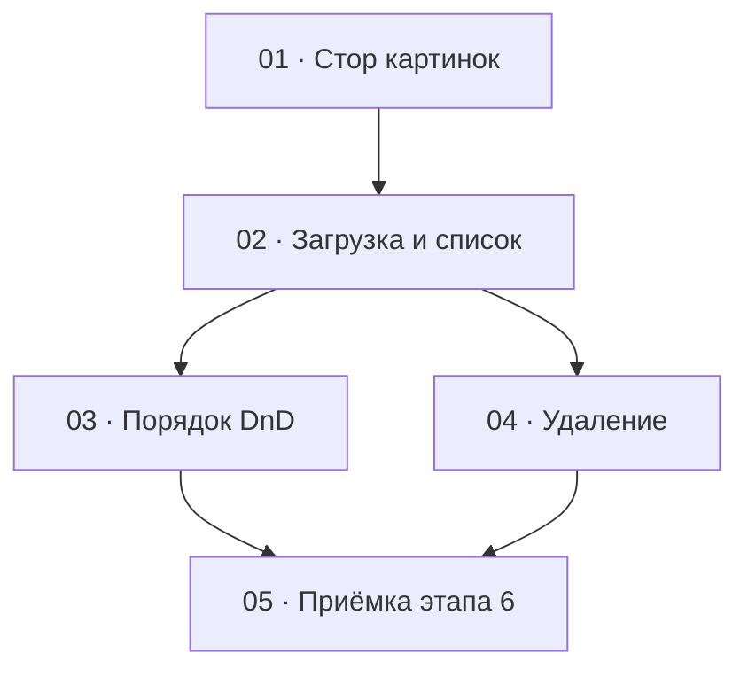

# Этап 6 — Изображения композиции: декомпозиция на задачи

Источник: [03-technical-specification.md, раздел «Этап 6»](../../03-technical-specification.md#этап-6--изображения-композиции).
Карта вызовов — [картинки](../../02-staff-api.md#7-картинки).

Формат файлов — по [task-writing-guidelines.md](../task-writing-guidelines.md).
Порядок номеров — топологический порядок графа ниже. Этап опирается на
карточку композиции: [стор](../step-4/01-compositions-store.md),
[карточка `/compositions/:id`](../step-4/04-composition-card.md),
блоки аудио и отрезков [этапа 5](../step-5/README.md),
[HTTP-клиент](../step-0/02-http-client.md) (JSON и пустой успех; multipart
для одного поля `file` — [задача 1 этапа 5](../step-5/01-audio-clips-store.md);
этот этап переиспользует тот же путь для поля `files`),
[сессию](../step-1/01-session-model.md) и
[перехватчик `401`](../step-1/02-refresh-on-401.md).

Заметки и первая загрузка через `GET /compositions/:id/full` в этот этап
не входят —
[этап 7](../../03-technical-specification.md#этап-7--заметки-а-знали-ли-вы),
[этап 8](../../03-technical-specification.md#этап-8--сборка-карточки-композиции).
Маршрут карточки и стык загрузки строки композиции (без `GET /full`) —
решения [этапа 4](../step-4/README.md#решения-по-открытым-вопросам-этапа);
этот этап их не перерешает и `GET /full` не вызывает. До этапа 8
картинки читаются своим `GET /compositions/:id/images`.

## Граф зависимостей

## Список задач

| # | Задача | Зависит от | Файл |
|---|--------|------------|------|
| 1 | Стор: загрузка, список, порядок, удаление; multipart `files` на клиенте | этап 0 (низкоуровневый вызов), этап 5 (путь FormData), этап 4 (корневой стор) | [01-images-store.md](./01-images-store.md) |
| 2 | Блок загрузки и списка с превью на карточке | 1; карточка этапа 4; блоки этапа 5 уже на экране | [02-images-upload-and-list.md](./02-images-upload-and-list.md) |
| 3 | Перетаскивание порядка (`imageIds` — полный набор) | 2 | [03-images-reorder.md](./03-images-reorder.md) |
| 4 | Удаление картинки с подтверждением | 2 | [04-images-delete.md](./04-images-delete.md) |
| 5 | Приёмка этапа 6 целиком | 3, 4 | [05-step6-acceptance.md](./05-step6-acceptance.md) |

## Почему такой порядок

- **01** — единственное место, где собираются multipart с полем `files`
  (несколько файлов, одно имя поля, повторный `append`), тело
  `{ imageIds }` как полная замена, пустой `204` удаления и ответ с
  `fileUrl` сразу (контракт отрезков сюда не копировать). Пока форма не
  зафиксирована тестом, экран легко поставит `file` вместо `files`,
  JSON-заголовок на `FormData` или выдумает опрос статусов. Экран в
  эту задачу не входит. Расширение / обобщение HTTP-клиента под
  multipart с произвольным именем поля и несколькими частями — здесь
  же, на том же клиенте этапа 0 / пути этапа 5; второго `fetch` нет.
- **02** сажает на карточку `/compositions/:id` блок загрузки и списка
  с превью. Без него нет смысла тащить DnD и удаление. Порядок и
  удаление сюда не входят: иначе тест поля `files` / лимита 10
  смешается с полным `imageIds` и диалогом подтверждения.
- **03 и 04** зависят от списка (и от стора), друг от друга — нет.
  Перетаскивание проверяет полный `imageIds`; удаление — пустой `204`
  и подтверждение. Смешивать их в одном тесте нельзя. Общий файл —
  карточка из этапа 4 и блок из 02. Если правки столкнутся, сначала
  вливается 03 (порядок на списке), затем 04 (действие строки).
- **05** ничего не добавляет к продукту. DoD этапа — живой
  `quizbeat-srv`, реальные картинки и зелёные проверки вместе: несколько
  файлов уходят, порядок после DnD совпадает с повторным `GET`,
  удаление убирает карточку, в `imageIds` уходит полный набор. Пока
  03 и 04 не в одном дереве, приёмке нечего закрывать.

**Конфликт на файле карточки с этапом 5.** Блок картинок вливается
**после** блоков аудио и отрезков этапа 5 (загрузка трека → волна /
точки → список отрезков → действия отрезка → затем картинки). Внутри
этапа 6: сначала 02, затем 03, затем 04.

Этап попадает под обязательное человеческое ревью
[раздела 7](../../04-development-rules.md#7-ревью--двухуровневое):
загрузка файлов — какое поле multipart (`files`, не `file`), что
клиент обещает пользователю про тип и размер (сервер всё равно
проверяет содержимое; SVG не предлагать). Развилки ролей нет: обе роли
staff ведут картинки. Сессию и токены этап не трогает. Текст с сервера
(`message`) рисуется как текст React, без `dangerouslySetInnerHTML`.
Уровень 1 (`/code-review` с явным уровнем) остаётся правилом на каждую
задачу и отдельной задачей этапа не становится.

## Решения по открытым вопросам этапа

ТЗ задаёт набор вызовов и DoD и не фиксирует, где на карточке живёт
блок и какую библиотеку DnD ставить. Ниже — решения, чтобы задачи не
выбирали их порознь. Вопросов, которые блокируют старт, нет.
`GET /compositions/:id/full` на этом этапе не вызывать.

- **Блок живёт на карточке `/compositions/:id`.** Второго экрана и
  смены маршрута нет. Этап 4 зафиксировал карточку как единственный
  экран правки; этап 5 добавил аудио и отрезки; этот этап добавляет
  блок картинок **ниже** блоков этапа 5. Стык первой загрузки строки
  композиции не заменяется на `GET /full` — это
  [этап 8](../../03-technical-specification.md#этап-8--сборка-карточки-композиции).
  До него список — только `GET /compositions/:id/images`.
- **Поле multipart — `files` (несколько файлов, одно имя поля).** Не
  `file` (это аудио этапа 5). В `FormData` каждый файл —
  `append('files', file)`. Путать имя — `400`, до проверки типа файл
  часто не доходит. Заголовок `Content-Type: application/json` на
  multipart ставить нельзя. Клиент этапа 5 уже умеет `FormData` с
  одним полем `file`; этот этап на втором использовании (правило 5)
  обобщает тот же метод на произвольное имя поля и несколько частей,
  а не копирует транспорт. Второго `fetch` и второго HTTP-модуля нет.
  Правка клиента — только в [задаче 1](./01-images-store.md); задачи
  экрана клиент не трогают.
- **Не больше 10 файлов за запрос.** Лимит интерсептора сервера —
  `FilesInterceptor('files', 10, …)`
  ([контроллер](../../../../quizbeat-srv/src/composition-images/composition-images.controller.ts)).
  Пустой набор — `400` `files is required`. 11-й файл с тем же именем
  поля — multer `LIMIT_UNEXPECTED_FILE` → Nest `400` с `message`
  `Unexpected field - files`. Клиент не даёт отправить 0 и больше 10,
  но отказ сервера всё равно показывает строкой `message`.
- **Лимит размера — `STORAGE_MAX_IMAGE_SIZE_BYTES` (дефолт 10485760),
  не аудио 200 МБ.** Лимит задаётся в
  [`CompositionImagesModule`](../../../../quizbeat-srv/src/composition-images/composition-images.module.ts)
  через свой `MulterModule.registerAsync`. На этом маршруте сверхлимит
  отсекает multer раньше валидатора хранилища: `413` и `message`
  `File too large` (константа `LIMIT_FILE_SIZE` у multer / Nest
  `PayloadTooLargeException`). Строка
  `File exceeds the maximum allowed size for this category` —
  сообщение
  [`FileValidationService`](../../../../quizbeat-srv/src/storage/file-validation.service.ts);
  до неё запрос этого размера на multipart-маршруте не доходит.
  Клиент показывает пришедший `message`, не ждёт одну конкретную
  строку `413`. Подсказка jpg / png / webp и ориентир 10 МБ серверную
  проверку не заменяют. SVG в
  [`ALLOWED_FILE_TYPES.image`](../../../../quizbeat-srv/src/storage/allowed-file-types.ts)
  нет — в подсказке UI не предлагать.
- **`fileUrl` есть сразу** после успешной загрузки. Асинхронной
  обработки и опроса статусов нет. Это не контракт отрезков. Ссылка —
  presigned, TTL по умолчанию 3600 с
  ([общие правила карты](../../02-staff-api.md#1-общие-правила)); в
  стор как постоянный адрес не класть. Протухшую превью запрашивают
  список заново (`GET .../images`).
- **`imageIds` — полная замена.** Тело `PATCH .../images/order` —
  `{ imageIds }` со **всем** текущим набором id в новом порядке, не
  разница. Пустой массив не отправляется (`@ArrayMinSize(1)`).
  Несовпадение набора — `400` с
  `imageIds must contain exactly the current set of composition image ids, without duplicates, omissions or unknown ids`
  ([`IMAGE_ID_SET_MISMATCH_MESSAGE`](../../../../quizbeat-srv/src/composition-images/constants.ts)).
  `order` в ответе — индекс с 0. Путь `.../images/order` — литеральный
  сегмент `PATCH` (`@Patch('order')`), не id картинки: на `DELETE`
  висит `:imageId` с `ParseUUIDPipe`, но это другой HTTP-метод —
  `order` в UUID-pipe не попадает.
- **Методы картинок** — рядом со стором композиций / аудио этапа 5
  (тот же домен `compositionId`) или в отдельном сторе того же
  корневого `src/stores/root-store.ts`, если так чище. Второй
  HTTP-клиент не заводить.
- **Библиотека DnD выбирается при реализации задачи 3**, по тайпингам
  именно установленной версии в `node_modules` (правило 4
  [правил разработки](../../04-development-rules.md)). До реализации
  зависимость не добавляется. В этой декомпозиции имя пакета и его
  пропы не фиксируются. DoD-тест — что в `imageIds` уходит полный
  текущий набор в новом порядке, не имя библиотеки.
- **Удаление — жёсткое, `204` без тела**, с подтверждением. Это не
  мягкое удаление композиции (`200` с `deletedAt`).
- **Обе роли staff** ведут картинки. Отдельного `403` по роли сервер
  не отвечает. Сообщения сервера показываются как пришли; подписи
  блока — русские.
