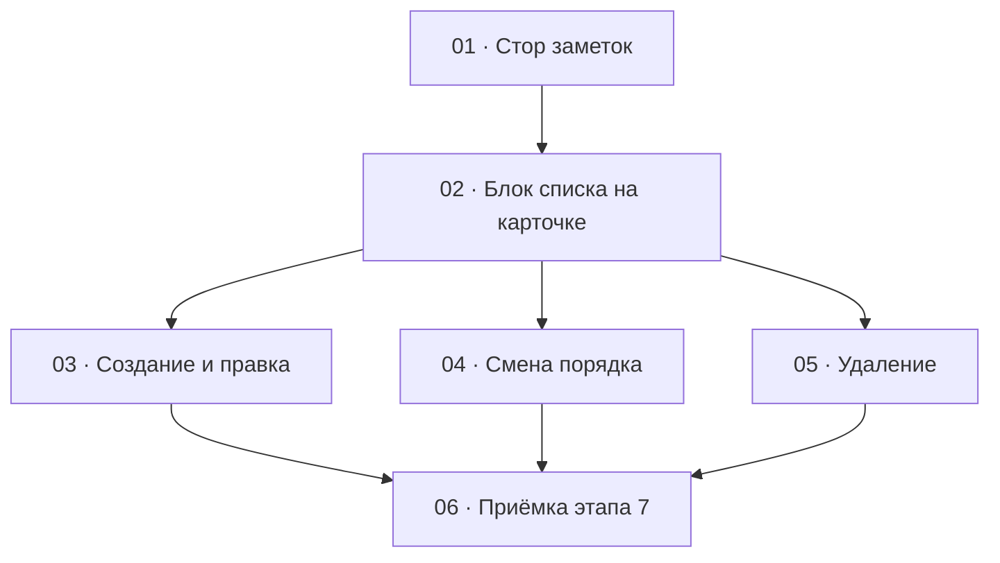

# Этап 7 — Заметки «А знали ли Вы?»: декомпозиция на задачи

Статус этапа: не выполнен. Сводка — [status.md](../status.md).

Источник: [03-technical-specification.md, раздел «Этап 7»](../../03-technical-specification.md#этап-7--заметки-а-знали-ли-вы).
Карта вызовов — [заметки](../../02-staff-api.md#8-заметки).

Формат файлов — по [task-writing-guidelines.md](../task-writing-guidelines.md).
Порядок номеров — топологический порядок графа ниже. Этап опирается на
карточку композиции: [стор](../step-4/01-compositions-store.md),
[карточка `/compositions/:id`](../step-4/04-composition-card.md),
блоки аудио [этапа 5](../step-5/README.md) и картинок
[этапа 6](../step-6/README.md),
[HTTP-клиент](../step-0/02-http-client.md) (только JSON и пустой успех;
multipart этот этап не расширяет),
[сессию](../step-1/01-session-model.md) и
[перехватчик `401`](../step-1/02-refresh-on-401.md).

Форма переводов — по образцу [тегов](../step-3/README.md) (поле
перевода здесь `text`, у тега — `name`). Порядок набора id — по
образцу [картинок](../step-6/README.md) (`noteIds` как `imageIds`).

Карточка уже открывается одним `GET /compositions/:id/full` — решение
[этапа 4](../step-4/README.md#решения-по-открытым-вопросам-этапа); этот
этап его не перерешает и сам `GET /full` не вызывает. Массив `notes` из
этого ответа уже есть в состоянии карточки к моменту, когда монтируется
блок этого этапа, — начальный список читается оттуда, а не отдельным
`GET /compositions/:id/notes` на маунте; этот эндпоинт остаётся способом
перечитать список после создания, правки, порядка и удаления.

## Граф зависимостей

## Список задач

| # | Задача | Зависит от | Файл | Статус |
|---|--------|------------|------|--------|
| 1 | Стор: список, создание, правка, порядок, удаление | этап 0 (клиент JSON и пустой `204`), этап 4 (корневой стор) | [01-notes-store.md](./01-notes-store.md) | не выполнена |
| 2 | Блок списка на карточке `/compositions/:id` | 1; карточка этапа 4; блоки этапов 5–6 уже на экране | [02-notes-list.md](./02-notes-list.md) | не выполнена |
| 3 | Создание и правка: оба перевода `text` | 2 | [03-note-form.md](./03-note-form.md) | не выполнена |
| 4 | Смена порядка (`noteIds` — полный набор) | 2 | [04-notes-reorder.md](./04-notes-reorder.md) | не выполнена |
| 5 | Удаление заметки с подтверждением | 2 | [05-notes-delete.md](./05-notes-delete.md) | не выполнена |
| 6 | Приёмка этапа 7 целиком | 3, 4, 5 | [06-step7-acceptance.md](./06-step7-acceptance.md) | не выполнена |

## Почему такой порядок

- **01** — единственное место, где собираются `translations` с полем
  `text` (не `name`), тело `{ noteIds }` как полная замена, литеральный
  путь `.../notes/order` и пустой `204` удаления. Пока форма запроса не
  зафиксирована тестом, экран легко скопирует поле тега, подставит
  uuid вместо сегмента `order` или отправит частичный набор. Экран в
  эту задачу не входит.
- **02** сажает на карточку блок списка. Без него нет смысла вешать
  форму, порядок и удаление. Создание, правка, порядок и удаление сюда
  не входят: иначе тест чтения списка смешается с правилом «оба
  перевода», полным `noteIds` и диалогом подтверждения.
- **03, 04 и 05** зависят от списка (и от стора), друг от друга — нет.
  Форма проверяет оба `text`; порядок — полный `noteIds`; удаление —
  пустой `204` и подтверждение. Смешивать их в одном тесте нельзя.
  Общий файл — карточка из этапа 4 и блок из 02. Если правки
  столкнутся, сначала вливается **03** (кнопка «Создать» и правка
  строки), затем **04** (действия смены порядка), затем **05**
  (удаление строки).
- **06** ничего не добавляет к продукту. DoD этапа — живой
  `quizbeat-srv` и зелёные проверки вместе: заметка с обоими текстами
  создаётся, меняет порядок, правится и удаляется; запрос с одним
  переводом не уходит. Пока 03–05 не в одном дереве, приёмке нечего
  закрывать.

**Конфликт на файле карточки с этапами 5–6.** Блок заметок вливается
**после** блока картинок этапа 6 (аудио / отрезки → картинки →
заметки). Внутри этапа 7: сначала 02, затем 03, затем 04, затем 05.

Этап не попадает под обязательное человеческое ревью
[раздела 7](../../04-development-rules.md#7-ревью--двухуровневое):
сессии и токенов он не касается, развилки ролей нет, загрузки файлов
нет. Обе роли staff ведут заметки — это не развилка `ADMIN` /
`SUPER_ADMIN`. Текст заметок рисуется как текст React, без
`dangerouslySetInnerHTML`. Уровень 1 (`/code-review` с явным уровнем)
остаётся правилом на каждую задачу и отдельной задачей этапа не
становится.

## Решения по открытым вопросам этапа

ТЗ задаёт набор вызовов и DoD и не фиксирует, где на карточке живёт
блок и как именно человек меняет порядок. Ниже — решения, чтобы задачи
не выбирали их порознь. Вопросов, которые блокируют старт, нет. Этот
этап сам `GET /compositions/:id/full` не вызывает — карточка уже
вызвала его на этапе 4, и блок читает результат оттуда.

- **Блок живёт на карточке `/compositions/:id`.** Второго экрана и
  смены маршрута нет. Этап 4 зафиксировал карточку как единственный
  экран правки и уже открывает её одним `GET /full`; этапы 5–6 добавили
  аудио и картинки; этот этап добавляет блок заметок **ниже** блока
  картинок. Начальный список — `notes` из ответа `full`, уже
  сохранённого состоянием карточки; `GET /compositions/:id/notes`
  остаётся способом перечитать список после мутаций, не способом первой
  загрузки.
- **Поле перевода — `text`.** У элемента `translations` поля `locale` и
  `text`. Поле `name` — у тегов; в тело заметки его не класть. Массив —
  ровно два элемента (`ru` и `en`), не объект с ключами-локалями.
  Правило полноты —
  [`assertCompleteTranslations`](../../../../quizbeat-srv/src/common/assert-complete-translations.ts),
  `message`
  `Translations must include exactly one entry per locale (ru, en), without duplicates`.
- **Создание и правка — одна форма.** Поля: текст `ru`, текст `en`.
  Создание — `POST .../notes` с `translations` из двух элементов.
  Правка — `PATCH .../notes/:noteId` с тем же полным набором обеих
  локалей, даже если изменили один текст. Опустить `translations` или
  отправить одну локаль нельзя: на экране видны оба текста, сохранённым
  должно оказаться то, что в полях. Пустое любое из двух полей запрос
  не отправляет. Отдельного `GET` одной заметки нет — правка из строки
  списка.
- **Путь порядка — литеральный `.../notes/order`.** На сервере
  `@Patch('order')` зарегистрирован **раньше** `@Patch(':noteId')`
  ([контроллер](../../../../quizbeat-srv/src/notes/notes.controller.ts)):
  иначе сегмент `order` попал бы в `ParseUUIDPipe` как `noteId`.
  Клиент ходит на `PATCH /compositions/:id/notes/order`, не подставляет
  слово `order` как id и не шлёт порядок на `PATCH .../notes/:noteId`.
- **`noteIds` — полная замена.** Тело `{ noteIds }` со **всем** текущим
  набором id в новом порядке, не разница. Пустой массив не отправляется
  (`@ArrayMinSize(1)`). Несовпадение набора — `400` с
  `noteIds must contain exactly the current set of note ids, without duplicates, omissions or unknown ids`
  ([`NOTE_ID_SET_MISMATCH_MESSAGE`](../../../../quizbeat-srv/src/notes/constants.ts)).
  `order` в ответе — индекс с 0.
- **Смена порядка — кнопки «выше» / «ниже».** ТЗ этапа 7 говорит
  «меняет порядок», не «перетаскивание» (слово «перетаскивание» явно
  только у картинок этапа 6). Кнопок достаточно, если после действия в
  сеть уходит полный `noteIds`. DnD-библиотеку ради симметрии с
  картинками не добавлять. Если при реализации выберут перетаскивание —
  DoD-тест всё равно смотрит на тело `noteIds`, не на API жеста; имя
  пакета в декомпозиции не фиксируется.
- **Методы заметок** — рядом со стором композиций / картинок (тот же
  домен `compositionId`) или в отдельном сторе того же корневого
  `src/stores/root-store.ts`, если так чище. Второй HTTP-клиент не
  заводить. Multipart этот этап не трогает.
- **Удаление — жёсткое, `204` без тела**, с подтверждением. У заметки
  нет файла в хранилище. Это не мягкое удаление композиции.
- **Обе роли staff** ведут заметки. Отдельного `403` по роли сервер не
  отвечает. Сообщения сервера показываются как пришли; подписи блока —
  русские. Текст заметки — React-текст, без
  `dangerouslySetInnerHTML`.
- **Открытый вопрос: мутация блока на мягко удалённой композиции** —
  тот же вопрос, что у [этапа 5](../step-5/README.md#решения-по-открытым-вопросам-этапа)
  (композицию мягко удалили между открытием карточки и `POST .../notes`
  / `PATCH .../notes/:noteId` / `PATCH .../notes/order` /
  `DELETE .../notes/:noteId`). Решение по умолчанию — там же: `404`
  показывается как ошибка API на блоке, без выхода из сессии.
