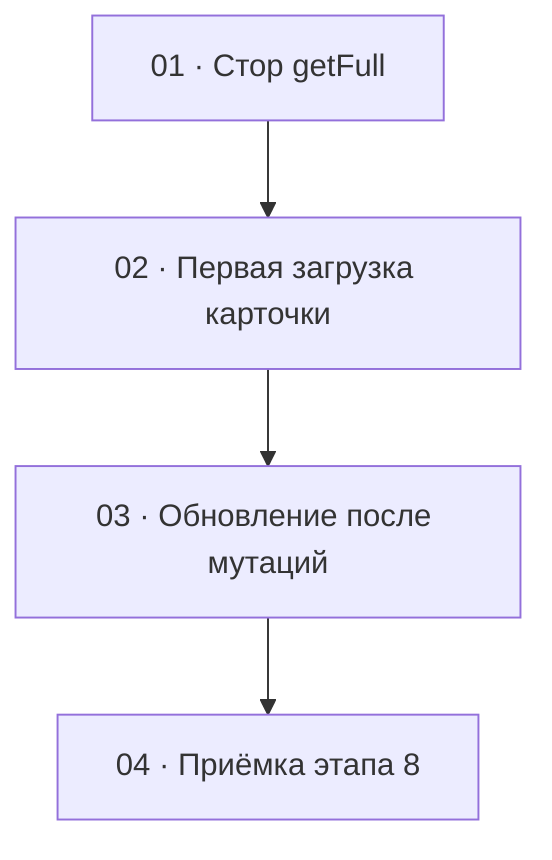

# Этап 8 — Сборка карточки композиции: декомпозиция на задачи

Источник: [03-technical-specification.md, раздел «Этап 8»](../../03-technical-specification.md#этап-8--сборка-карточки-композиции).
Карта вызовов — [композиции](../../02-staff-api.md#5-композиции), строка
`GET /compositions/:id/full`; общие правила про presigned —
[§1](../../02-staff-api.md#1-общие-правила).

Формат файлов — по [task-writing-guidelines.md](../task-writing-guidelines.md).
Порядок номеров — топологический порядок графа ниже. Этап опирается на
карточку и блоки предыдущих этапов:

- стык первой загрузки строки — [этап 4](../step-4/README.md) /
  [задача 4](../step-4/04-composition-card.md) (`location.state` или
  повторный `GET /compositions` по query списка; отдельного
  `GET /compositions/:id` нет);
- аудио и отрезки — [этап 5](../step-5/README.md) (длительность до этого
  этапа — только из `201` загрузки; волна — `GET .../audio`; опрос —
  `GET .../clips`);
- картинки — [этап 6](../step-6/README.md) (первая загрузка блока —
  свой `GET .../images`);
- заметки — [этап 7](../step-7/README.md) (первая загрузка блока —
  свой `GET .../notes`).

Этап **заменяет** стык загрузки карточки и первую загрузку списков
блоков одним `GET /full`. Сценарии мутаций блоков 5–7 (загрузка трека,
точки, опрос, DnD, форма заметок) остаются на месте и не переписываются
как новые фичи — меняется только то, откуда экран берёт данные на
открытии и чем обновляет блок после мутации.

Это последний этап ТЗ клиента. Нового маршрута, игрока и восстановления
композиции нет.

## Граф зависимостей

## Список задач

| # | Задача | Зависит от | Файл |
|---|--------|------------|------|
| 1 | Стор: `GET /compositions/:id/full`, `null` аудио-полей, `404` | этап 0 (клиент), этап 4 (стор композиций) | [01-full-card-store.md](./01-full-card-store.md) |
| 2 | Первая загрузка карточки одним `GET /full`; пустые состояния и `404` | 1; карточка этапа 4; блоки этапов 5–7 | [02-card-first-load.md](./02-card-first-load.md) |
| 3 | Правило обновления блоков после мутаций (без смешения `fileUrl`) | 2 | [03-post-mutation-refresh.md](./03-post-mutation-refresh.md) |
| 4 | Приёмка этапа 8 целиком | 3 | [04-step8-acceptance.md](./04-step8-acceptance.md) |

## Почему такой порядок

- **01** — единственное место, где фиксируется контракт агрегата:
  один вызов, поля `clips` / `images` / `notes`, `null` у
  `originalAudioUrl` / `originalAudioDurationSec` без выдуманного
  `GET .../audio`, `404` наружу без очистки сессии. Пока разбор не
  зафиксирован тестом, экран легко примет `null` за ошибку или снова
  дернёт пачку списков. Экран в эту задачу не входит.
- **02** заменяет стык
  [задачи 4 этапа 4](../step-4/04-composition-card.md) и первую загрузку
  блоков 5–7: на маунте карточки — один `GET /full`, а не
  `location.state` / повторный список и не пачка
  `GET .../clips` + `GET .../images` + `GET .../notes` + `GET .../audio`.
  Пустые состояния и `404` / ошибка сети — здесь. Без этого 03 не к чему
  привязать правило «данные уже на экране».
- **03** — один стык обновления после мутаций для всех блоков. Если
  размазать «не смешивать `fileUrl`» по четырём экранам без общего
  теста, легко подменить блок ответом `POST .../images` из двух новых
  файлов и затереть третью. Правила — в таблице ниже; задача их
  закрепляет кодом и тестами на моке.
- **04** ничего не добавляет к продукту. DoD этапа — в сети на открытии
  один `GET /full`, блоки 5–7 по-прежнему выполняют свой сценарий,
  пустая композиция читается и даёт загрузить трек, `404` — отдельное
  состояние. Пока 01–03 не в одном дереве, приёмке нечего закрывать.

Этап не попадает под обязательное человеческое ревью
[раздела 7](../../04-development-rules.md#7-ревью--двухуровневое):
сессии и токенов он не касается, развилки ролей нет, новое поле
multipart не вводит, `dangerouslySetInnerHTML` не появляется. Смешение
протухшего `fileUrl` — нюанс задач 02–03, не новый гейт ревью.
Загрузка файлов уже проходила человеческое ревью на этапах 5–6; этот
этап её сценарии не переписывает. Уровень 1 (`/code-review` с явным
уровнем) остаётся правилом на каждую задачу и отдельной задачей этапа
не становится.

## Решения по открытым вопросам этапа

ТЗ задаёт один `GET /full` на открытии, актуальность после мутаций,
пустые состояния и `404`, но не фиксирует по каждой мутации, чем именно
обновлять блок. Ниже — решения, сверенные с кодом сервисов
`quizbeat-srv`. Вопросов, которые блокируют старт, нет.

### Первая загрузка

- **Открытие экрана, прямой заход и F5 — только
  `GET /compositions/:id/full`.** Двух постоянных способов загрузки не
  держать: стык этапа 4 (`location.state` / повторный
  `GET /compositions` по query) этим этапом **заменяется**.
  `location.state` со списка можно использовать как мгновенный заголовок
  (название / автор), пока идёт `GET /full`, но **не** как источник
  `clips` / `images` / `notes` / `originalAudioUrl` /
  `originalAudioDurationSec`. Список эти поля не содержит
  ([`CompositionResponseDto`](../../../../quizbeat-srv/src/compositions/dto/composition-response.dto.ts)).
- **`originalAudioUrl` и `originalAudioDurationSec` при отсутствии
  трека — `null`, не отсутствие полей**
  ([`getFull`](../../../../quizbeat-srv/src/compositions/compositions.service.ts),
  [`CompositionFullResponseDto`](../../../../quizbeat-srv/src/compositions/dto/composition-full-response.dto.ts)).
  `null` — пустое состояние «трек не загружен», не ошибка и не повод
  чистить сессию. Метод стора при `null` **не** вызывает
  `GET .../audio`.
- **Длительность для разметки после этапа 8 берётся из полной
  карточки**, в том числе после F5. Ограничение этапа 5 «после F5
  новые точки не слать, пока нет длительности с последнего `201`»
  этим **снимается**. Длительность из `<audio>` / волны по-прежнему не
  подставлять.
- **Мягко удалённая композиция и несуществующий id — `404`.**
  `findOrThrow` фильтрует `deletedAt IS NULL`. Это состояние «не
  найдена», не пустая карточка с кнопкой загрузки трека.
- **Опрос `GET .../clips` при `PENDING` / `PROCESSING` остаётся.**
  Полная карточка на открытии опрос не заменяет. Ответ опроса — полный
  список отрезков; им заменяют блок `clips` целиком. Не склеивать новые
  элементы с `fileUrl` из первого `GET /full`.
- **`fileUrl` отрезка по-прежнему отсутствует в JSON, пока статус не
  `DONE`.** Это не `null`.

### Обновление после мутаций

Правило одно на мутацию. «Либо ответ, либо перечитать» без выбора не
оставлять. Где ответ мутации — **полный текущий набор блока**, им
блок заменить можно. Где ответ частичный или пустой — перечитать
затронутый блок своим `GET` (не обязательно весь `GET /full`: блок уже
умеет свой список, и так честнее для TTL одной сущности).

| Мутация | Ответ сервера | Чем обновляется блок на клиенте |
|---|---|---|
| Открытие / F5 | `GET /full` | Единственный источник: поля композиции, `tags`, `clips`, `images`, `notes`, `originalAudioUrl`, `originalAudioDurationSec` |
| `POST .../audio` | `{ originalAudioDurationSec }` — **без URL** ([`UploadAudioResponseDto`](../../../../quizbeat-srv/src/compositions/dto/upload-audio-response.dto.ts)) | Обновить длительность из `201`; **сбросить** прежний `originalAudioUrl`; взять новую ссылку **`GET .../audio`** (`{ url }`). Не оставлять старый URL. Presigned в стор как постоянный адрес не класть |
| `GET .../audio` (протухшая ссылка на оригинал) | `{ url }` | Подставить новый `url` в поле волны / оригинала. Не переиспользовать сохранённую строку |
| `POST .../clips` | Массив **только новых** отрезков ([`AudioClipsService.create`](../../../../quizbeat-srv/src/audio-clips/audio-clips.service.ts)) | **Не** подменять блок этим массивом. После отправки — опрос / `GET .../clips` (полный список) → заменить `clips` целиком |
| `GET .../clips` (опрос) | Полный список | Заменить блок `clips` целиком. Не мержить с `fileUrl` из `GET /full` |
| `POST .../clips/:clipId/regenerate` | Один отрезок (`PENDING`, без `fileUrl`) | Заменить в текущем массиве элемент с этим `id` ответом (статус `PENDING`, поля `fileUrl` нет). Весь блок одним объектом не подменять. Дальше блок обновляет опрос `GET .../clips`, как для любого `PENDING` |
| `DELETE .../clips/:clipId` | Пустой `204` | Перечитать **`GET .../clips`**. Удалённого id на экране не оставлять |
| `POST .../images` | Массив **только что загруженных** ([`CompositionImagesService.upload`](../../../../quizbeat-srv/src/composition-images/composition-images.service.ts)) | **Не** подменять блок этим массивом (пропадут уже бывшие). После загрузки — **`GET .../images`** → заменить `images` целиком |
| `PATCH .../images/order` | Полный список (`list()`) | Заменить блок `images` ответом |
| `DELETE .../images/:imageId` | Пустой `204` | Перечитать **`GET .../images`** |
| `POST .../notes` | Одна заметка | **Не** подменять массив одной заметкой. После создания — **`GET .../notes`** → заменить `notes` целиком |
| `PATCH .../notes/:noteId` | Одна заметка | Заменить в текущем массиве элемент с этим `id` ответом; **не** записывать `[заметка]` вместо всего списка |
| `PATCH .../notes/order` | Полный список (`list()`) | Заменить блок `notes` ответом |
| `DELETE .../notes/:noteId` | Пустой `204` | Перечитать **`GET .../notes`** |
| `PATCH /compositions/:id` | `CompositionResponseDto` **без** `clips` / `images` / `notes` / `originalAudioUrl` ([`update`](../../../../quizbeat-srv/src/compositions/compositions.service.ts)) | Обновить **только** поля композиции и `tags`. Не записывать ответ поверх всего экрана |
| Протухшая `fileUrl` картинки / готового отрезка | — | Заново `GET .../images` или `GET .../clips` (или `GET /full`). Не переиспользовать сохранённую строку. TTL по умолчанию 3600 с |

Почему после частичных мутаций выбран свой `GET` блока, а не повторный
`GET /full`: ответ того же `list()`, что уже используют этапы 5–7;
не трогает соседние блоки; для протухшего URL одного типа файла не
нужно заново подписывать всё. Повторный `GET /full` допустим как
аварийный путь (например, после серии ошибок), но штатное правило —
таблица выше.

### Что этап не делает

- Новые поля форм, новый маршрут, игрок, восстановление композиции.
- Переписывание сценариев загрузки трека, разметки точек, опроса,
  DnD картинок и формы заметок — только стык данных на открытии и
  после мутации.
