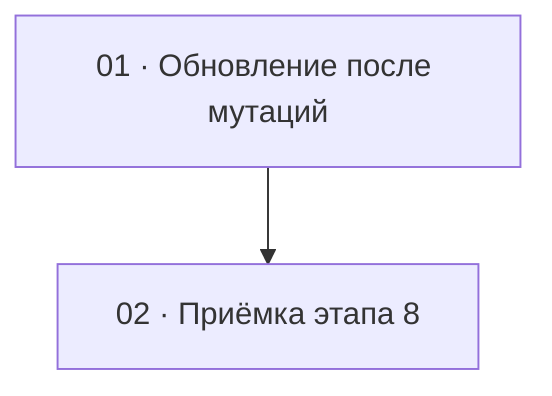

# Этап 8 — Сборка карточки композиции: декомпозиция на задачи

Источник: [03-technical-specification.md, раздел «Этап 8»](../../03-technical-specification.md#этап-8--сборка-карточки-композиции).
Карта вызовов — [композиции](../../02-staff-api.md#5-композиции), строка
`GET /compositions/:id/full`; общие правила про presigned —
[§1](../../02-staff-api.md#1-общие-правила).

Формат файлов — по [task-writing-guidelines.md](../task-writing-guidelines.md).
Порядок номеров — топологический порядок графа ниже.

**Открытие карточки одним `GET /compositions/:id/full` этот этап не
вводит** — это решение [этапа 4](../step-4/README.md#решения-по-открытым-вопросам-этапа):
карточка открывается им с самого начала, а блоки этапов 5–7 читают
`clips` / `images` / `notes` / `originalAudioUrl` / `originalAudioDurationSec`
из того же ответа при первом рендере, а не своим первым запросом. Этот
этап решает последнее, что остаётся нерешённым после этапов 4–7: как
экран остаётся согласованным **после** мутации блока, когда ответы
мутаций неоднородны (где-то полный список, где-то только новые элементы,
где-то пустой `204`). Это последний этап ТЗ клиента. Нового маршрута,
игрока и восстановления композиции нет.

## Граф зависимостей

## Список задач

| # | Задача | Зависит от | Файл |
|---|--------|------------|------|
| 1 | Правило обновления блоков после мутаций (без смешения `fileUrl`) | этап 4 (карточка и `GET .../full`), этапы 5–7 (блоки мутаций) | [01-post-mutation-refresh.md](./01-post-mutation-refresh.md) |
| 2 | Приёмка этапа 8 целиком | 1 | [02-step8-acceptance.md](./02-step8-acceptance.md) |

## Почему такой порядок

- **01** — единственная оставшаяся задача этапа: один стык обновления
  после мутаций для всех блоков. Если размазать «не смешивать `fileUrl`»
  по четырём экранам без общего теста, легко подменить блок ответом
  `POST .../images` из двух новых файлов и затереть третью. Правила — в
  таблице ниже; задача их закрепляет кодом и тестами на моке.
- **02** ничего не добавляет к продукту. DoD этапа — на живом
  `quizbeat-srv`, когда все блоки уже на экране, ни одна мутация не
  оставляет устаревших данных. Пока 01 не в дереве, приёмке нечего
  закрывать.

Этап не попадает под обязательное человеческое ревью
[раздела 7](../../04-development-rules.md#7-ревью--двухуровневое):
сессии и токенов он не касается, развилки ролей нет, новое поле
multipart не вводит, `dangerouslySetInnerHTML` не появляется. Смешение
протухшего `fileUrl` — нюанс задачи 01, не новый гейт ревью. Загрузка
файлов уже проходила человеческое ревью на этапах 5–6; этот этап её
сценарии не переписывает. Уровень 1 (`/code-review` с явным уровнем)
остаётся правилом на каждую задачу и отдельной задачей этапа не
становится.

## Решения по открытым вопросам этапа

ТЗ задаёт актуальность экрана после мутаций, но не фиксирует по каждой
мутации, чем именно обновлять блок. Ниже — решения, сверенные с кодом
сервисов `quizbeat-srv`. Вопросов, которые блокируют старт, нет.

### Первая загрузка — уже не вопрос этого этапа

- Открытие, прямой заход и F5 карточки — один `GET /compositions/:id/full`
  с этапа 4. `originalAudioUrl` и `originalAudioDurationSec` при
  отсутствии трека — `null`, не отсутствие полей. Мягко удалённая
  композиция и несуществующий id — `404`. Блоки этапов 5–7 читают
  `clips` / `images` / `notes` из этого же ответа на первом рендере, не
  своим первым запросом. Всё это — решения и код этапов 4–7; здесь не
  переповторяются.
- Опрос `GET .../clips` при `PENDING` / `PROCESSING` (этап 5) остаётся:
  полная карточка на открытии его не заменяет и не отменяет. Ответ
  опроса — полный список отрезков; им заменяют блок `clips` целиком, не
  склеивая с `fileUrl` из первого `GET /full`.
- `fileUrl` отрезка по-прежнему отсутствует в JSON, пока статус не
  `DONE`. Это не `null`.

### Обновление после мутаций

Правило одно на мутацию. «Либо ответ, либо перечитать» без выбора не
оставлять. Где ответ мутации — **полный текущий набор блока**, им
блок заменить можно. Где ответ частичный или пустой — перечитать
затронутый блок своим `GET` (не обязательно весь `GET /full`: блок уже
умеет свой список, и так честнее для TTL одной сущности).

| Мутация | Ответ сервера | Чем обновляется блок на клиенте |
|---|---|---|
| Открытие / F5 | `GET /full` | Единственный источник первого рендера: поля композиции, `tags`, `clips`, `images`, `notes`, `originalAudioUrl`, `originalAudioDurationSec` — решено на этапе 4 |
| `POST .../audio` | `{ originalAudioDurationSec }` — **без URL** ([`UploadAudioResponseDto`](../../../../quizbeat-srv/src/compositions/dto/upload-audio-response.dto.ts)) | Обновить длительность из `201`; **сбросить** прежний `originalAudioUrl`; взять новую ссылку **`GET .../audio`** (`{ url }`). Не оставлять старый URL. Presigned в состояние как постоянный адрес не класть |
| `GET .../audio` (протухшая ссылка на оригинал) | `{ url }` | Подставить новый `url` в поле волны / оригинала. Не переиспользовать сохранённую строку |
| `POST .../clips` | Массив **только новых** отрезков ([`AudioClipsService.create`](../../../../quizbeat-srv/src/audio-clips/audio-clips.service.ts)) | **Не** подменять блок этим массивом. После отправки — опрос / `GET .../clips` (полный список) → заменить `clips` целиком |
| `GET .../clips` (опрос) | Полный список | Заменить блок `clips` целиком. Не мержить с `fileUrl` из `GET /full` |
| `POST .../clips/:clipId/regenerate` | Один отрезок (`PENDING`, без `fileUrl`) | Заменить в текущем массиве элемент с этим `id` ответом (статус `PENDING`, поля `fileUrl` нет). Весь блок одним объектом не подменять. Дальше блок обновляет опрос `GET .../clips`, как для любого `PENDING` |
| `DELETE .../clips/:clipId` | Пустой `204` | Перечитать **`GET .../clips`**. Удалённого id на экране не оставлять |
| `POST .../images` | Массив **только что загруженных** ([`CompositionImagesService.upload`](../../../../quizbeat-srv/src/composition-images/composition-images.service.ts)) | **Не** подменять блок этим массивом (пропадут уже бывшие). После загрузки — **`GET .../images`** → заменить `images` целиком |
| `PATCH .../images/order` | Полный список (`list()`) | Заменить блок `images` ответом |
| `DELETE .../images/:imageId` | Пустой `204` | Перечитать **`GET .../images`** |
| `POST .../notes` | Одна заметка | **Не** подменять массив одной заметкой. После создания — **`GET .../notes`** → заменить `notes` целиком |
| `PATCH .../notes/:noteId` | Одна заметка | Заменить в текущем массиве элемент с этим `id` ответом; **не** записывать `[заметка]` вместо всего списка |
| `PATCH .../notes/order` | Полный список (`list()`) | Заменить блок `notes` ответом |
| `DELETE .../notes/:noteId` | Пустой `204` | Перечитать **`GET .../notes`** |
| `PATCH /compositions/:id` | `CompositionResponseDto` **без** `clips` / `images` / `notes` / `originalAudioUrl` ([`update`](../../../../quizbeat-srv/src/compositions/compositions.service.ts)) | Обновить **только** поля композиции и `tags`. Не записывать ответ поверх всего экрана |
| Протухшая `fileUrl` картинки / готового отрезка | — | Заново `GET .../images` или `GET .../clips` (или `GET /full`). Не переиспользовать сохранённую строку. TTL по умолчанию 3600 с |

Почему после частичных мутаций выбран свой `GET` блока, а не повторный
`GET /full`: ответ того же `list()`, что уже используют этапы 5–7;
не трогает соседние блоки; для протухшего URL одного типа файла не
нужно заново подписывать всё. Повторный `GET /full` допустим как
аварийный путь (например, после серии ошибок), но штатное правило —
таблица выше.

### Что этап не делает

- Новые поля форм, новый маршрут, игрок, восстановление композиции.
- Переписывание сценариев загрузки трека, разметки точек, опроса,
  DnD картинок и формы заметок — только стык данных после мутации.
